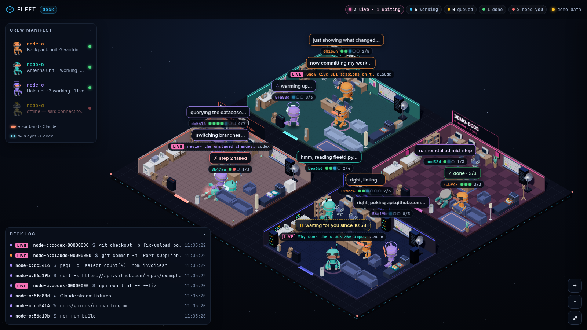
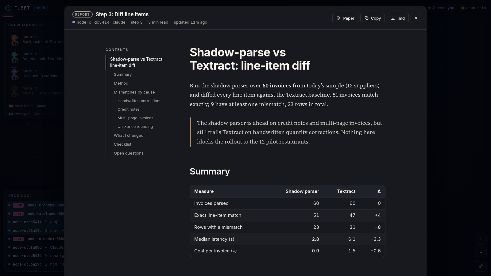

# Agent Fleet

Run Claude Code and Codex jobs on your own machines. See what every agent is doing
from one terminal or a local dashboard.

Fleet sends an ordered task list to a host over SSH. The agent works through the
steps in one session, so later steps can build on earlier work. You can send context,
follow activity, add steps, and collect the result without juggling SSH tabs.



*The deck groups jobs by project. Each android shows the host and agent, while the
log and speech bubbles show current work. Screenshot uses synthetic demo data.*

## What you can do

- Send steps to Claude Code or Codex on an SSH host or this machine. Attach files
  or directories as context and choose the agent's permission mode.
- Use `fleet ls`, `fleet watch`, or the deck to see progress, failures, todos,
  and active interactive Claude Code or Codex sessions across hosts.
- Read step reports, open Markdown documents in the deck, and pull files the
  agent placed in its outbox.

Fleet uses your SSH access and a small Python host runner. There is no central
service to deploy.

## Get started

You need [uv](https://docs.astral.sh/uv/) and Python 3.10 or newer locally. On each
host, you need SSH access, Python 3.8 or newer, `tmux`, `rsync`, and an authenticated
Claude Code or Codex CLI.

```bash
git clone https://github.com/adieyal/agent-fleet.git
cd agent-fleet
uv tool install .

fleet host add worker --ssh worker  # any SSH target you can already reach
fleet install worker                # copy the runner and locate agent CLIs
```

Use `fleet host add laptop --local` for this machine. Re-run `fleet install <host>`
after updating `fleet/remote/fleetd.py`.

Send a job with a clear goal and checkable steps:

```bash
fleet send -H worker -p myrepo -d "Fix flaky invoice tests" -C ~/src/myrepo \
  -s "Find why tests/test_invoice.py is flaky" \
  -s "Fix it and run that test file" \
  -c notes.md
```

Check on it from the terminal or open the deck:

```bash
fleet ls
fleet web --open
```

Use `fleet watch` for a live terminal view. When the job finishes, run
`fleet result worker:<id>` for its reports or `fleet pull worker:<id> ./results`
for outbox files. `fleet wait worker:<id>` blocks until it finishes.

After starting the deck, open `http://localhost:8787/?demo` to explore it with
synthetic jobs. The demo works even when the configured host is offline.

Room signs can use friendly names without changing the project identifiers used by
jobs. Add `"project_labels": {"restoke-analytics": "Bang bang!"}` to
`~/.config/fleet/config.json` (or the file selected by `FLEET_CONFIG`), then
restart `fleet web`.

To give a project a stable identity across hosts, register it and link each host's
label explicitly. Same-named labels on other hosts stay separate until you link them.

```bash
fleet project add "Agent Fleet" --link home:agent-fleet --repo git@github.com:adieyal/agent-fleet.git
fleet project ls                      # IDs, links, and links suggested by matching repositories
fleet project link p-1a2b3c4d gpu:fleet
fleet project unlink gpu:fleet
fleet project rename p-1a2b3c4d "Fleet"   # the ID never changes
fleet project repo add p-1a2b3c4d https://github.com/adieyal/agent-fleet
```

Projects are stored under `"projects"` in the same config file. A repository only
suggests links in `fleet project ls`; nothing links until you run `fleet project link`.
The deck's `/api/state` reports each job's and session's `project_id`, which is null
when its label is unlinked.

Focus is where you are putting resources: priority or background. Each room in the
deck has a priority/background switch at its front corner; one click sets it. A
background room is dimmed and desaturated, its androids lose their speech bubbles and
stay nearly still however busy they are, and its props rest. Rooms never move when
focus changes. Work is focused through its registered project when its label is
linked, otherwise through the label itself, so unregistered rooms can be focused too.
Anything you have never set is in priority. Choices are live workspace state, kept in
`workspace.json` beside the config file (not in the registry, not in Git), and every open
deck updates as soon as one changes.

Things that need you are attention items, derived only from what the hosts report:
a failed or stalled job is a blocker, and a session whose latest step is a question
for you (`AskUserQuestion`) or a plan to approve (`ExitPlanMode`) is a decision. A
room with an open item gets a lantern outside its front corner: a diamond with ✋ or
?, and a count when there is more than one. It swings once when an item arrives and
then stays still. Click it to list the room's items, open the job or session, and
acknowledge (the lantern stays, dimmer) or snooze one for an hour (it hides until
then). Items resolve by themselves when the job is retried or removed or the session
moves on; looking at one never changes it. `/api/state` lists them under `attention`.

The header's **deck | building** switch shows the same fleet as a building seen in
cross-section, one floor per registered project; the deck stays the default and the
choice is remembered. Priority floors are open, background floors are windowed and
glow warm while runs are active, and free floors say "To let". The building has six
floors unless the config sets `"capacity"` (1 to 10); raising it is a deliberate
edit. A project keeps its floor, kept in `workspace.json`: the lowest free one when it
moves in. The lobby shows the host key and any visitors, labels with work that no
project claims; **Move in** registers one as a project on the lowest free floor.
A floor with attention items gets one lantern beside it (items on no floor hang theirs
by the lobby). Each name plate has an open · windows switch for the project's focus.
Click a floor to enter it: the deck shows just that project's work, with a lift panel
on the right edge (a button per floor, L for the whole building); Esc steps back out.

## Read the work

The deck collects step reports, Markdown files the agent wrote, and Markdown in its
outbox. Select a document to read it with a contents list, tables, footnotes, and
task lists. You can copy the Markdown source or download it as a `.md` file.

To browse documents from a local project repository, add it to the deck's library:

```bash
fleet library add agent-fleet ~/src/agent-fleet
fleet web
```

Open **Library** in the deck header to search its top-level Markdown files and
`docs/` tree. These files stay in their repository; the library reads them from the
machine running `fleet web`. Run `fleet libraries` to see configured roots.

Automatic discovery is the default. To choose the display order or hide documents,
add `.fleet/library.json` to the project repository:

```json
{
  "order": ["docs/design/philosophy.md", "docs/design/workspace-hierarchy.md"],
  "hide": ["README.md"],
  "show_unlisted": true
}
```

Paths are relative to the project root. Listed documents appear first, followed by
other discovered Markdown files. Set `show_unlisted` to `false` to show only the
listed documents; `hide` always takes precedence. The manifest controls the list,
not access to files through the local dashboard.



*The reader opens a report from the synthetic demo. The same view works for files
from real jobs.*

## How it works

```text
fleet CLI / fleet web ── SSH ──▶ fleetd.py on each host
                                  └─ tmux runner ─▶ claude -p / codex exec
                                     ~/.fleet/jobs/<id>/
                                       job.json, events.jsonl, context/, outbox/
```

`fleetd.py` uses the Python standard library. Fleet copies it to each host and runs
it over SSH. Jobs run in a private tmux server; subsequent steps resume the same
agent session. The local dashboard receives host updates over SSH and sends them to
the browser with server-sent events. The optional [Fleet skill](skill/SKILL.md) lets
a local Claude dispatch and monitor jobs.

Claude jobs default to `acceptEdits`; Codex jobs default to `workspace-write`. Use
`fleet send --permission` when a job needs a different mode.

### Dashboard access

`fleet web` binds to `127.0.0.1` by default. Its `/api/state`, `/api/stream`, and
`/api/doc` endpoints have no authentication and can show job descriptions, activity,
working directories, session details, and Markdown documents. The library endpoints
also expose Markdown under configured local project roots. Anyone who can reach
the dashboard can read that data. Keep it on loopback or use an SSH tunnel. Add
access control before binding it to a shared network. Its writes, `POST /api/focus`,
`POST /api/attention/…` and `POST /api/move-in`, change `workspace.json` (and, for
moving in, the project registry in the config); they refuse requests from pages on
other origins, but anyone who can reach the dashboard directly can use them.

Agents can place Markdown outside the job directory in the document list, so review
the dashboard's reachability before running jobs with sensitive files.

For jobs that need private Git access, the host can use a user-level SSH agent. One
setup runs `ssh-agent -D -a %t/fleet-ssh-agent.sock` as
`~/.config/systemd/user/fleet-ssh-agent.service` with lingering enabled. Run
`fleet unlock worker` once per boot to add the key to that agent.

## Development

```bash
uv sync --locked
uv run --locked python -m unittest discover -s tests -v
uvx ruff@0.13.2 check fleet tests
uv build
```

The project code is licensed under [Apache-2.0](LICENSE). Bundled assets have
their own terms in [asset credits](fleet/web/assets/CREDITS.md) and the
[three.js license](fleet/web/vendor/three/LICENSE).
