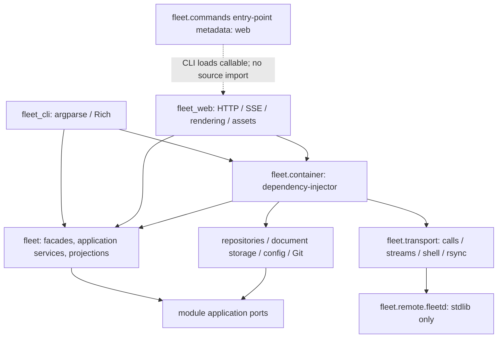

# ADR 0010: Extract the Fleet library

Status: implemented through workspace migration (steps 1–8); final packaging verification remains. Date: 2026-10-04; updated 2026-10-05. Branch: `extract/library`; base: `4641086`.

Split into three distributions with a library-owned dependency-injector container. Extract workflows before moving the presentation packages. Preserve commands, JSON/HTTP shapes, actors, initialization, transactions, retention paths and standalone worker deployment. The layout and container below are implemented; historical evidence and the original move inventory remain dated to the base commit.



## Evidence and scope

The brief overrides the constitution where it forbids real-store writes and all main/push/deploy operations. No project charter was supplied; the only charter in this checkout is a test fixture. Choices below satisfy the brief and constitution's “A choice between options that all satisfy this document and the brief” rule. No user-only choice is needed. Four `fleet decision record --work-item 20956ae8-2762-4887-8297-62cbfab21b22 ... --actor extract-library-m1` commands succeeded against an isolated audit mirror of the brief’s work item; output is collected in `DECISIONS.json`. Decision commands use isolated temporary paths, with collected JSON records; these are local audit records, not publication into the orchestrator's live store.

`fleet/cli.py:43` currently couples the presentation packages:

```python
from fleet.web.server import serve, serve_fixture
```

`fleet/web/server.py:359` owns worker process construction:

```python
process = subprocess.Popen(host.fleetd_command(["stream", "--events", EVENTS_PER_JOB]),
                           stdin=subprocess.DEVNULL, stdout=subprocess.PIPE, stderr=subprocess.PIPE)
```

`fleet/composition.py:56` binds transactions by constructing another facade graph:

```python
def bound(self, unit):
    return facades(self.store, unit)
```

`fleet/web/live.py:74` combines registry linking, historical run assignment and document relocation. Preserve this ordering, including file locks and redirects; do not turn it into a new SQLite/filesystem atomicity guarantee. `fleet/web/overview.py:305` derives status from stories, questions, jobs and recency: move this projection, preserving its precedence, rather than having HTTP infer status.

Inventory commands:

```sh
wc -l fleet/cli.py fleet/web/*.py
rg -n '^(class |def |    def )|subprocess|ssh|open_|Facades|TriageScheduler' fleet/cli.py fleet/web/*.py
```

Relevant output: CLI 2,462 lines; web Python 2,932 lines; total 5,394. The symbol inventory below comes from Python AST line numbers, supplemented by handler-body and constant inspection. Locations refer to this step's pre-refactor source.

## 1. Inventory and target homes

Targets in this section are import paths under `packages/fleet/src/fleet`. “Extract” means only the workflow/query/storage part of a mixed command; argparse, stdin/file argument reading, Rich/text/JSON rendering, HTTP validation and error-to-status mapping stay in presentation. Simple facade calls remain calls to injected facades, not duplicate library wrappers.

| Source and example | Non-presentation responsibility → target |
| --- | --- |
| `fleet/cli.py:66` `resolve`; `:767` `resolve_job_or_session`; `:1511–1549` IDs | Retained-first job/prefix lookup, ambiguity and worker/session lookup → `services.references`; generic prefix algorithm stays `identifiers`. Local context URI discovery at `:1520` → `services.context`; warning text remains CLI. |
| `cli.py:222–258` listing helpers; `:916` notify | Configured-host validation, concurrent job/session gathering, project-link filtering → `services.jobs`; change detection for notifications → `projections.notifications`. CLI watch interval/display and notification printing remain CLI. |
| `cli.py:266–279` read_steps | CLI argument/file decoding remains CLI; canonical step normalization and work-reference validation → `services.dispatch` / `services.references`. No argparse types enter library. |
| `cli.py:280` push_context; `:371` push_guided_context; `:618–632` push/pull | Existence checks, context rsync, pinned guidance staging, outbox directory creation → `services.context`; shell/rsync execution → `transport`. Preserve paths and current pull default. |
| `cli.py:289–373` dispatch/delivery; `:502–525` retry/dispatch-work | Project/work consistency, payload building, guidance pinning, dispatch intent, idempotency/reconcile/start/wait coordination → `services.dispatch`; Execution remains authoritative writer. UUID generation and worker argument serialization belong here. |
| `cli.py:383–457` triage policy/status | Mandate parse/validation, forbid judging criteria, unchanged comparison, confirmed-write check → `services.triage`; policy storage remains Records. Scheduler status projection via container → `projections.triage`. CLI policy diff prose remains CLI. |
| `cli.py:458–501` orchestrate/control | Local-controller constraint, activation/mandate/payload assembly, environment propagation, delivery after dispatch/retry → existing `orchestration` plus `services.dispatch`; inject ControllerCommands instead of constructing it. |
| `cli.py:526–575` resolve/link/add; `:576–617` blocked answer/start | Facade delegation remains CLI; step-work validation, matching unanswered blocked step, continuation idempotency hash, worker acknowledgement and attention resolution → `services.jobs`. Example: preserve `<attention-id>:answer` key and confirmation `('applied', step)`. |
| `cli.py:633`, `:675–766` show/tail/attach/wait/result/cancel | Worker queries and command payloads → `services.jobs`; Popen, SSH master setup, execvp, interactive shell, termination → `transport`. Wait-many polling / any-job cancellation → `services.jobs`, yielding completion events; CLI chooses exit code and prints. |
| `cli.py:781–811` move/remove | Label selection and remote move; observe/index/copy trace before rm and mark retained run removed afterwards → `services.jobs` / `ingestion`. Preserve force semantics. |
| `cli.py:828–915` history/run detail/usage | Filtered history → injected `projections.run_history`; kept-document enrichment (`:859`) → `projections.run_history` with document reader port; storage traversal → `services.storage`; store usage adapter → infrastructure. |
| `cli.py:949–1038` host/library config | Configuration mutations, library key ownership, root validation, host removal's remaining-link query → `services.configuration` with `infrastructure.config`; host probing → `services.jobs`. |
| `cli.py:1040–1110`, `:1191–1270` project commands | Host:label resolution, multi-link creation, project linking + run/document migration, management registration, merge counts, repo edits, restoration, observed-label/remotes suggestions → `services.projects`. Domain rules stay Workspace/Records; gathered suggestion data → `projections.workspace`. |
| `cli.py:1112–1188` guidance | Work-prefix/project/epic subject resolution → `services.references`; promote remains `orchestration`; guidance/history reads → Records/projections. stdin/file text ingestion remains CLI. |
| `cli.py:1285–1354` detection/install/hooks/unlock | DETECT_SCRIPT, AGENT_SOCKET, first-hit PATH merge, copy fleetd/configure/hooks → `services.hosts`; subprocess and interactive ssh-add → `transport`. CLI retains tty requirement, messages and exit code. |
| `cli.py:1357–1367` web | Configuration queries → injected config service; invocation → entry-point protocol described below. No server import. |
| `cli.py:1377–1458` status/work detail | Tree selection/depth/open filtering, ancestry and historical attention aggregation → `projections.project`; parser conversion and print_status_item remain CLI. |
| `cli.py:1553–1597` work | CLI field decoding remains CLI; evidence required-result invariant belongs Work application; criteria/parent/relation/project reference resolution → `services.references`; unknown-kind feedback data from Work. |
| `cli.py:1662–1730` decisions | Job-run ambiguity, controller-versus-local-worker routing, required fields, streamed decision envelope and worker delivery → `services.decisions`; epic/project scope validation → `projections.decisions`. Preserve remote controller routing. |
| `cli.py:1763–1872` history/prune/answer/attention | History querying → projection; prune preview/span and mutation → `services.history` (CLI owns --yes confirmation); blocked-versus-decision answer dispatch → `services.attention`; project/id/context resolution → references/context. Facade attention operations retain mandate checks. |
| `cli.py:1875`, `:2423–2462` startup | Environment actor derivation and explicit config/store path checks → `services.configuration`; lazy container bootstrap preserves missing FLEET_STORE policy (web may create; other commands refuse), work/epic normalization and worker-decision routing exceptions. CLI retains exception display and exit codes. |

All web files are accounted for:

| Source | Library extraction; retained presentation |
| --- | --- |
| `web/__init__.py` | Empty; move to `fleet_web/__init__.py`. |
| `web/job_store.py:36–333` | ProjectDocuments, safe paths/privacy, locks, atomic replacement, label redirects, merge, observation/copy indexes, raw reads, working-file traversal → `infrastructure.documents.job_store`. Remove renderer import: raw content/metadata only. Public operations exposed via document service/port. |
| `web/job_store.py:334–384` | DocumentKeeper pending-job coalescing, thread, copy error recording, trace callback, settle → `services.documents`. Storage adapter stays synchronous. Rendering at `:275`, `:302` moves to `fleet_web.documents`. |
| `web/ingester.py:14–123` | Entire file → `ingestion`: timestamps, step-work attribution, host availability, observed runs/sessions/steps, usage/activity, document/trace indexing, streamed decision deduplication and explicit rejection alerts. Keep caches per service lifetime. |
| `web/library.py:27–74`, `:112–249` | Privacy/filter rules, Ralph/repository scanning, configured roots, mtime/title cache, manifest validation, safe reads, image type/size/path checks → `infrastructure.documents.library`; port/constants/errors → `services.documents` public API. PRD-to-Markdown (`:76`) and HTML decoration stay `fleet_web.library`. |
| `web/documents.py:20–44`, `:60–90` | Path validation, remote reads, asset decode/error translation and caps → `services.documents` + transport. STATUS_LINE raw normalization → document service. MarkdownIt setup, outline (`:47`), file-preview explanation / pull command and render_markdown (`:93`) remain `fleet_web.documents`. |
| `web/overview.py:39–67`, `:332` | File/text cache, stat/read/scandir → `infrastructure.documents.overview`; read port supplied to projection. |
| `web/overview.py:68–331`, `:341–364` | Parsing, homes/workstreams, story/question/status/recency precedence, job availability/traces and overview shape → `projections.overview`. Retain existing descriptive labels in projection to preserve response bytes/meaning; no import of HTML renderer. |
| `web/guidance.py:10–35` | Guidance version/history/policy and promotion marker/epic/project decision aggregation → `projections.guidance`. Web decorates raw body with render_markdown. |
| `web/live.py:32–377` | Shared state ports/caches → `services.live`; project commands `:61–157`, focus `:173` → `services.projects`; building settling `:158` remains command before read-only projection; library identity/availability/overview `:184–240` → `projections.documents`; attention actions/undo tokens/6s expiry `:241–277` → `services.attention`; focus/triage/attention and run-work/delivery enrichment `:278–329` → `projections.live`; pipeline retention `:330` → live service and pipeline projection `:338`; version notifications/snooze wake `:167`, `:363` → live service. No mixin constructs facades. |
| `web/server.py:94–334` | snapshot, FleetState restoration of offline state, facade/store/document creation, retention, records reconciliation, scheduler/history polling, ingestion/retries, registry/capacity refresh errors, host moves and raw reads → `services.live` (container constructs dependencies); state document → `projections.live`. BUILD added by web adapter after projection. |
| `web/server.py:335–481` | stale projection → `projections.live`; reconnect/catch-up/hello/heartbeat/removed/job/session/pipeline/input observation application → `ingestion`; stream Popen, pipe pumps, silence timeout, tail stderr and cleanup → `transport`. Service owns reconnect policy and application, HTTP owns no worker process. |
| `web/server.py:482–508` | Refusal/question/blocked detail aggregation → `projections.attention`, including refusal_rules. |
| `web/server.py:509–1071` | Handler retains HTTP parsing, shape/type checks, origins, error/status translation, response serialization, SSE coalesce/ping, asset CSP and static reads. Extract queries/mutations listed below; no open_*, facades(), transport execution or repository access in handler. |
| `web/server.py:1074–1087` | Host/history follower and fixture construction → container-provided live runtime / fixture service. serve/serve_fixture entrypoint chooses mode and starts runtime before HTTP serving. |
| `web/server.py:49–92`, `:1090–1097` | Static paths/types/build hash, HTTP server, browser opening and deck URL text remain `fleet_web.server`; checkout-art roots become an explicit development resource configuration. Preserve packaged-install 404 for checkout-only art. |
| `web/fixture.py:43–149` | Temporary store creation/seeding, work parent mapping, observed attention, kept documents, clock, pipeline snapshots, synthetic moves/registry/remotes/state → `services.fixtures` and `infrastructure.fixtures`, all created by container fixture factory with explicit temp config/home/management. Recorded file stays unchanged. |
| `web/fixture.py:150–203` | Fixture raw documents/assets and library/privacy/roots reads → fixture adapters; STATUS_LINE stripping → service; title/read HTML decoration remains `fleet_web.fixture`. Fixture service shares production commands/projections. |

Embedded handler extraction (HTTP checks stay in place):

| `web/server.py` location | Target/example |
| --- | --- |
| `:533–595` GET library/state/decision/bench | `projections.documents`, `projections.live`, `projections.attention`, `projections.bench`; resolve proposal via injected Decisions. |
| `:612–645` run_history | Injected history/detail projection plus kept-document counts; filter decoding remains HTTP. |
| `:691–729` guidance/decisions/history | `projections.guidance`, `projections.decisions`, `projections.history`. |
| `:730–767` change_guidance and callbacks | `services.guidance` calls Records or promote_decision then projection; preserve base-version conflict → 409. |
| `:768–850` focus/move-in/options/move-agent/merge/storehouse | Injected project command service; no duplicate domain rule in handler. |
| `:851–932` answer/refusals/blocked/attention | `services.attention`; preserve actor='user' for decision answer versus 'web-user' elsewhere and all 404/409/400 mappings. |
| `:954–1029` documents/assets/library/stored | Injected document service raw reads; web rendering occurs before respond; path and size policy belongs library, CSP belongs HTTP. |
| `:1030–1055` stream | Read injected state/version/pipeline service; wire protocol and HTTP writes remain web. |

## 2. Dependency-injector design

`fleet.container.Container(containers.DeclarativeContainer)` is the sole infrastructure composition root. Replace cached_property composition with real providers; a thin public Services aggregate may expose resolved facade attributes and bound(unit), but never constructs a repository. Final adapters import Container/public services only; remove legacy open_* once migrated rather than maintaining parallel composition.

| Provider | Lifetime / dependencies |
| --- | --- |
| `settings` | Singleton of explicit environment/config resolution: config/store/home/management paths, job actor, clock; preserve current defaults only, introduce no masking fallback. Bootstrap validates CLI mode before Store creation. |
| `transport` | Singleton transport adapter around existing functions plus stream/events/wait/shell/exec operations; config access injected. No global process starts at import. |
| `store` | Singleton Store(path, clock, job), not a shared SQLite connection. Connections remain unit-local as today. Root shared providers use ThreadSafeSingleton because HTTP/follower/keeper threads can resolve concurrently; unit-local providers use Singleton. |
| `evidence`, `repository_writer`, `config_repository`, `project_documents`, `project_library`, `overview_reader` | Singleton stateless/cache/locked adapters as appropriate; constructed only here. Document roots/config required from settings. |
| `attention_repository`, `workspace_repository`, `records_repository`, `work_repository`, `execution_repository`, `decisions_repository`, `authority_repository`, `library_repository`, `triage_repository` | Singleton within one facade scope, all receive same store and scope unit. Lazy callbacks for repository transaction collaborators. Private provider names; entrypoints never resolve these directly. |
| `attention`, `workspace`, `records`, `work`, `execution`, `decisions`, `authority`, `library` | Singleton per scope; preserve constructor arguments in composition.py, clock, management home, decision sources, authority/work lazy references, mandate/routing callbacks, and send/grant/answer/step adapters. Workspace actor variants via Factory using same repository. |
| `unit_of_work` | Factory returning unopened store.unit_of_work context manager. Workflows use `with unit_of_work() as unit`; SQLite retains commit/rollback/history enforcement. |
| `bound_services` | Factory/function creating and caching a fresh scope container on each unit, with store and transport/adapters overridden by parent provider delegates and unit=Object(unit). Root scope uses unit=None explicitly. Calling twice for the same unit returns the same facade identities, as `_facades` does today. |
| projections | Factory query objects/callables bound to public facades and raw document/cache read ports: existing activity/attention/bench/building/decisions/history/project/run_history/workspace and new documents/guidance/live/notifications/overview/triage. No storage construction or writes in projections. |
| `controller_commands`, `triage_commands` | Factory with resolved Services and per-call activation. Change ControllerCommands(store, ...) composition lookup to dependency injection. |
| `triage_scheduler`, `dispatch`, `jobs`, `projects`, `documents`, `guidance`, `attention_commands`, `configuration`, `history`, `decision_commands`, `host_installation`, `context`, `storage` | Factory or scope Singleton application services; scheduler receives scope facade aggregate, injected deliver function and host resolver. Read-only triage status must not invoke scheduling. |
| `live_runtime`, `fixture_runtime` | Factory for each server instance; own conditions, cursors, undo cache, keeper, indexed/taken caches, host/pipeline state and threads. Fixture factory gets isolated child settings/store/adapters; never uses live configuration. |

Circular collaborators must remain lazy. Pass providers' `.provider` delegates or explicit typed callback functions rather than invoking authority/decisions/work providers while another singleton is being built. `routing_history` business calculation at `composition.py:69–96` moves to an attention routing service/projection with injected Execution/Authority/Decisions; container only assembles it. Records decision_source and Work/Execution authority suppliers stay lazy. A scoped Services object resolves a facade only on attribute access and supplies callbacks to bound scopes. Validate cyclic provider creation with all facade access orders and a multi-module transaction test; do not resolve the entire graph eagerly.

Bound scopes must reuse overridden parent adapters and facade factories, not instantiate a second unrelated Container with production defaults. A `ScopeContainer` has required store/unit/dependency providers. One root scope and one per active unit use the same graph declaration. Bound scope cleanup releases cached references at unit exit; no global mutable current-unit provider (web requests and keeper can overlap). Bound Execution keeps prepare_dispatch disabled as today; unbound prepares initialized workspace. Workspace initialization and legacy workspace import become explicit bootstrap providers, run at the same operation boundaries as current open_workspace/open_attention, not on every request nor silently omitted.

Use entrypoint container access, avoiding global wiring:

```python
# fleet_cli entrypoint, illustrative proposed interface
container = Container()
container.configuration().validate_startup(command=arguments.command)
services = container.services()
arguments.handler(arguments, services=services)

# fleet_web entrypoint: same container instance supplied by CLI plugin
runtime = container.live_runtime(hosts=hosts)
handler = make_handler(runtime, queries=container.projections(),
                       documents=container.documents())
```

No wiring modules or Provide markers are needed for this choice. dependency-injector constructs every service; handlers accept dependencies directly. A standalone `fleet-web` entrypoint creates its own Container then uses the same web bootstrap. If decorator injection is later adopted, only entrypoints wire their own `fleet_cli.commands` / `fleet_web.server` modules and unwire on shutdown; library never imports presentation modules for wiring.

Tests create one container per test with temporary paths, override before resolving singleton consumers, and pass it to main/server. For example:

```python
from dependency_injector import providers
with container.transport.override(providers.Object(fake_transport)):
    main(["install", "worker"], container=container)
```

Override store/clock/facade/query/runtime providers similarly; no monkeypatching fleet.composition or command globals. Fresh containers prevent singleton override cache contamination; scope factory propagates parent overrides. Unit tests can still directly construct a facade with fake ports. Worker stdlib tests stay independent of DI. Add meaningful transaction rollback, collaborator identity, concurrency, fixture isolation and override propagation tests. Existing behavioral assertions stay intact.

Provider overriding is documented in [Dependency Injector's official documentation](https://python-dependency-injector.ets-labs.org/providers/overriding.html); scoped context-manager overrides reset automatically. Scope identity and propagation above are Fleet's explicit design, not an assumed automatic DI feature.

## 3. Workspace, packaging and boundaries

Use src layouts and Hatchling throughout. Keep Python >=3.10 and distribution versions aligned initially (0.1.0); publishing is outside this step.

| Distribution / import root | Contents / declared dependencies |
| --- | --- |
| `fleet` / `fleet` | All modules, infrastructure, projections, errors, identifiers, transport, ingestion, services, orchestration, triage, scheduler, remote and container. Dependency: dependency-injector. No rich, MarkdownIt, HTTP presentation or front-end assets. |
| `fleet-cli` / `fleet_cli` | cli.py moved/split into entrypoint/commands/rendering/parser; argparse/Rich, metadata plugin loader; dependencies fleet and fleet-web and rich. Script `fleet = fleet_cli.cli:main`. CLI distribution depends on web distribution for install convenience; source does not import it. |
| `fleet-web` / `fleet_web` | HTTP/SSE server, Markdown/PRD/fixture renderers, entrypoint, complete static resources; dependencies fleet, markdown-it-py, mdit-py-plugins. Script `fleet-web = fleet_web.entrypoint:main`; no rich/CLI dependency. |

Root remains a non-built `agent-fleet` development project with `tool.uv.package = false`, member dependencies for all three, dev group and one lockfile. This preserves plain `uv run fleet`, pytest and lint commands with the whole workspace available. Set `tool.uv.workspace.members = ["packages/*"]`; root `tool.uv.sources` maps fleet, fleet-cli and fleet-web to `{workspace = true}`. Each member declares real versioned dependencies (initially `==0.1.0` between members), not just workspace sources. Hatch wheel package selections are explicit `src/fleet`, `src/fleet_cli`, `src/fleet_web`. Library and web distributions must be built alongside CLI.

The shared lockfile and member source mapping follow [uv's official workspace documentation](https://docs.astral.sh/uv/concepts/projects/workspaces/). Those settings apply to workspace development; installer compatibility must also be checked from built wheels outside the checkout.

For `fleet web`, fleet-web registers:

```toml
[project.entry-points."fleet.commands"]
web = "fleet_web.entrypoint:run"
```

The CLI parser retains current web flags/help. Handler uses `importlib.metadata.entry_points(group="fleet.commands")` to select exactly one `web`; zero or multiple registrations produce explicit FleetError (no direct-import fallback). `run(arguments, container)` is a structural callable protocol: namespace contains existing fixture/bind/port/open/host options; plugin requests configuration/hosts/runtime from supplied library container. fleet-web imports neither fleet_cli nor its parser. Plugin loading is deferred until invoking web so ordinary CLI imports stay independent.

`fleet-cli` declares mandatory fleet-web and fleet distribution dependencies; registry availability is not assumed. In development use `uv run fleet ...`; for local install build all three wheels with `uv build --all-packages --wheel` and use `uv tool install --find-links dist dist/fleet_cli-0.1.0-py3-none-any.whl` (the resolver also obtains third-party dependencies from its configured index). `uv tool install packages/fleet-cli` alone cannot resolve unpublished sibling wheels from workspace source metadata: document that limitation, do not promise otherwise. Wheel-install test verifies `fleet --help`, `fleet web --help`, plugin discovery and fixture HTTP/assets without repository PYTHONPATH. Publishing package names/registry availability is not needed to decide the local split; reserve/verify names before a later release.

Move `css`, `js`, `vendor`, `assets`, `index.html`, and **all** `prototype` files together under `fleet_web/static/`, preserving URL-relative paths and CREDITS/license files. Explicitly include the entire static tree in wheel and sdist (Hatch artifacts/force-include if ignore patterns would exclude generated assets). Use `importlib.resources.files('fleet_web').joinpath('static')` and read Traversable bytes with explicit path containment. This supports Python 3.10 without assuming directory `as_file` support. If an existing filesystem adapter requires a directory, explicitly materialize its tree in a temporary directory owned for the server lifetime. No cwd/repository dependency. Preserve startup index/css/js snapshot and existing build fingerprint semantics; exclude Python caches and refer only to served static resources after split. Test installed build-id change detection and static containment.

Development-only `/art/bakeoff/` and `/concept/` remain explicit optional checkout mounts and 404 when unavailable, exactly as server.py:77 says today. Never guess REPO_ROOT by parent depth in src layout. Prototype static assets themselves are always packaged; checkout external prototype images/models retain existing installed absence. Verify prototype routes against installed wheel as well as source.

`fleet.remote.fleetd` moves unchanged to `packages/fleet/src/fleet/remote/fleetd.py`: stdlib only, no library/DI imports. `fleet install <host>` obtains it via importlib.resources, materializes for rsync for the copy duration, and sends the same target `~/.local/share/fleet/fleetd.py`; DETECT_SCRIPT, configuration, tmux check and agent-socket behavior stay intact. Compile/run the copied file in an isolated worker home using stdlib Python without installed fleet. Controller transport still uses remote configured Python/path overrides.

### File moves (implementation steps use git mv)

| From | To / split |
| --- | --- |
| `fleet/` excluding cli.py and web/ | `packages/fleet/src/fleet/` |
| `fleet/composition.py` | `packages/fleet/src/fleet/container.py`; bootstrap/provider definitions replace composition, not a relocated hand-built graph |
| `fleet/cli.py` | `packages/fleet-cli/src/fleet_cli/cli.py`, then extract inventory workflows into library services/projections |
| `fleet/web/job_store.py` | library `infrastructure/documents/job_store.py`; keeper → `services/documents.py` |
| `fleet/web/ingester.py` | library `ingestion.py` |
| `fleet/web/live.py` | library `services/live.py`; split projections/commands as above |
| `fleet/web/overview.py` | library `projections/overview.py`; filesystem cache/read → infrastructure |
| `fleet/web/library.py` | library `infrastructure/documents/library.py`; PRD/HTML renderer → fleet_web/library.py |
| `fleet/web/guidance.py` | library `projections/guidance.py`; HTML decoration → fleet_web/guidance.py |
| `fleet/web/documents.py` | fleet_web/documents.py; raw reads/errors/policy → library services/documents.py |
| `fleet/web/fixture.py` | fleet_web/fixture.py rendering; seed/raw adapter → library infrastructure/fixtures.py + services/fixtures.py |
| `fleet/web/server.py` | fleet_web/server.py HTTP; state/follow/apply → library services/live.py + ingestion.py + transport.py |
| `fleet/web/{css,js,vendor,assets,prototype,index.html}` | `packages/fleet-web/src/fleet_web/static/` |
| `fleet/web/__init__.py` | `packages/fleet-web/src/fleet_web/__init__.py` |
| `tests/`, fixtures, scripts, art/, docs/ | Stay repository-root; update imports/resource helpers/paths. Test placement described below. |
| new files | Three member pyproject.toml files; library services/ports/query adapters; fleet_web/entrypoint.py; fleet_cli/plugin loader; packaging/boundary tests. |

Keep tests at root during this refactor so existing test commands/node IDs and shared safety/browser fixtures survive. Group new tests in `tests/packaging`, `tests/container`; existing modules/projections/integration directories stay. CLI/web tests import new roots; extracted algorithm tests import library modules. Root dev environment includes all members, while isolated wheel tests separately verify library-only and CLI+web installs. Update scripts/art/browser resource URLs and filesystem references found by rg; for example README.md:501–502 asset-credit/license links, scripts/checks/w2_decisions.py:46 module execution (`fleet.cli` → `fleet_cli.cli`), and tests/test_state_history_architecture.py:18 source-root scan must follow the moves; do not leave `fleet.web` compatibility imports that defeat contracts.

### Import-linter contracts

Set `root_packages = fleet, fleet_cli, fleet_web` (multiline configuration). Retain all eight module-public-surface contracts and application/domain layering; update module forbidden list to cover container/services/ingestion/transport/orchestration/triage/scheduler/projections/infrastructure and both presentation roots. Modules may use one another's public entrypoints as today.

Enforce explicit contracts, not only directories:

1. `fleet` forbidden from importing fleet_cli/fleet_web; the two presentation roots forbidden from importing each other in either direction, including indirect imports. Metadata strings are the runtime plugin seam; packaging test exercises it.
2. CLI/web forbidden from importing fleet.infrastructure, facade implementation descendants or fleet.remote.fleetd. Container/public API access allowed. They never instantiate adapters; add an AST construction check for known infrastructure constructors because import-linter alone cannot detect construction through a re-export. No Store re-export from container.
3. Layer graph: presentation → services/orchestration/triage_scheduler/triage/ingestion → transport → projections → modules → module application → domain. Container is an external composition root, excluded from that layered container because it legitimately imports every implementation. No service imports container (move existing composition imports out of orchestration); Services/ports types live outside container.
4. Infrastructure protected, allowed importer fleet.container only (infrastructure may import its own descendants). Private per-module protected contracts retained. Transport may access public config ports, not infrastructure construction.
5. Projections forbidden from services/ingestion/orchestration/triage_scheduler/triage/container/infrastructure/transport and presentation. Inject read ports for filesystem/history instead of import cycles. Read-only triage status calculation extracted from scheduler. Separate command settle from building projection.
6. Services/ingestion/triage/orchestration forbidden from infrastructure/container/presentation; transport supplied as public adapter/interface. `triage_scheduler` and `triage` explicitly listed in layer and forbidden contracts, closing today's omissions.
7. Standalone worker forbidden from every Fleet root (fleet, fleet_cli, fleet_web), `as_packages=False`; AST/stdlib subprocess test ensures no third-party imports either.
8. Protect services/projections/ingestion descendants if split into packages; expose documented public entrypoints; container may import provider implementations. Container forbidden from presentation, even for wiring strings/import side effects.

Proposed top layers allow peer workflow services to collaborate without downward-to-upward cycles; reverse service dependencies must use ports/callbacks rather than weaken contracts. Confirm actual import-linter configuration with all three roots and explicit violation fixtures (e.g. add a fleet_cli→fleet_web import and expect lint failure), not just a passing graph.

## 4. Execution and validation

Extract raw documents/ingestion/queries first, then CLI/web application workflows, then container and test provider overrides, then package moves/plugin/assets. Avoid adding fallbacks or changing business semantics while relocating. Preserve every existing assertion. Each later milestone follows its own orchestrator brief; this ADR does not authorize doing those steps now.

Required checks in subsequent code steps: focused non-browser tests for changed area, full non-browser suite and lint-imports after each step; browser tests when requested and for visible deck effects. Packaging checks inspect wheel/sdist file manifests, run out-of-checkout library import and installed CLI/plugin/fixture server with images/prototypes, and stdlib copied-fleetd smoke. Tests cover retained documents after rm, offline/catch-up/retry behavior, explicit error/empty states, shared transaction rollback and root override propagation. Example regression: linking a label must still update registry, assign earlier runs, move retained jobs, and redirect concurrent keeper copies.

M1 validation is recorded below after completion. No browser changes or code moves in this step.

## Symbol index (coverage cross-check)

Every mixed CLI function is listed with its extraction target; formatting-only helpers/parser definitions are intentionally retained in fleet_cli. Every web function/method is listed, including HTTP-only functions retained in fleet_web. Nested closures belong to their enclosing function and follow the handler table above.

| Source | Symbols (line) | Destination |
| --- | --- | --- |
| `fleet/cli.py` | `resolve:66`, `resolve_job_or_session:767`, `guidance_subject:1112`, `resolve_cli_id:1511`, `work_cli_id:1516`, `attention_cli_id:1543`, `resolve_step_work_ids:1547` | services.references |
| `fleet/cli.py` | `list_arguments:211`, `selected_hosts:216`, `gather_listing:225`, `command_list:246`, `command_watch:255`, `command_add:553`, `waiting_step:576`, `answer_waiting_step:583` | services.jobs / transport |
| `fleet/cli.py` | `command_start:605`, `command_show:633`, `command_tail:675`, `command_attach:691`, `wait_for:698`, `command_wait:743`, `command_result:748`, `command_cancel:761` | services.jobs / transport |
| `fleet/cli.py` | `command_move:781`, `command_remove:792`, `command_hosts:983` | services.jobs / transport |
| `fleet/cli.py` | `read_steps:266` | fleet_cli parsing + services.dispatch normalization |
| `fleet/cli.py` | `push_context:280`, `push_guided_context:374`, `command_push:618`, `command_pull:624`, `located_context:1520` | services.context |
| `fleet/cli.py` | `command_send:289`, `command_dispatch:293`, `deliver_dispatch:367`, `command_orchestrate:458`, `command_control:489`, `command_run_retry:502`, `command_dispatch_work:515` | services.dispatch / orchestration |
| `fleet/cli.py` | `command_resolve_unknown:526`, `command_run_link:534` | Execution facade |
| `fleet/cli.py` | `command_library_link:542` | Library facade |
| `fleet/cli.py` | `command_triage_policy:383`, `command_triage_status:428` | services.triage / projections.triage |
| `fleet/cli.py` | `command_history_runs:828`, `stored_run_detail:859`, `command_run_show:866` | projections.run_history |
| `fleet/cli.py` | `command_store_usage:904` | services.storage |
| `fleet/cli.py` | `command_notify:916` | projections.notifications / services.jobs |
| `fleet/cli.py` | `command_host_add:949`, `command_host_remove:968`, `local_library_key:993`, `command_library_add:1004`, `command_library_remove:1017`, `command_libraries:1029`, `default_actor:1875` | services.configuration |
| `fleet/cli.py` | `parse_link:1040`, `command_project_add:1048`, `command_project_rename:1060`, `command_project_link:1067`, `command_project_unlink:1078`, `command_project_merge:1084`, `command_project_management:1101`, `command_project_repo_add:1191` | services.projects / projections.workspace |
| `fleet/cli.py` | `command_project_repo_remove:1197`, `command_project_restore:1203`, `observed_labels:1217`, `command_project_list:1246` | services.projects / projections.workspace |
| `fleet/cli.py` | `command_guidance_show:1131`, `command_guidance_edit:1155`, `command_guidance_promote:1168`, `command_guidance_history:1176` | Records facade / orchestration |
| `fleet/cli.py` | `command_building_capacity:1271` | Workspace facade |
| `fleet/cli.py` | `merge_detected:1293`, `command_install:1312`, `command_hooks:1334`, `command_unlock:1345` | services.hosts / transport |
| `fleet/cli.py` | `command_web:1357` | fleet_cli plugin seam |
| `fleet/cli.py` | `status_node:1377`, `filter_status_items:1388`, `command_work_show:1402`, `command_status:1432` | projections.project |
| `fleet/cli.py` | `command_work:1553` | Work facade / services.references |
| `fleet/cli.py` | `job_run:1662`, `hand_decision_to_job:1670`, `command_decision_record:1682`, `command_decision_list:1704` | services.decisions / projections.decisions |
| `fleet/cli.py` | `command_history:1763`, `command_history_prune:1788` | projections.history / services.history |
| `fleet/cli.py` | `command_answer:1803`, `command_attention:1824` | services.attention / Attention facade |
| `fleet/cli.py` | `main:2423` | services.configuration + fleet_cli entrypoint |
| `fleet/web/documents.py` | `outline:48`, `fetch_document:59`, `fetch_asset:77`, `render_markdown:96` | services.documents raw access; renderer/outline → fleet_web.documents |
| `fleet/web/fixture.py` | `FixtureState.__init__:43`, `FixtureState.keep_recorded_documents:76`, `FixtureState.clock:91`, `FixtureState.job_hosts:94`, `FixtureState.load:98`, `FixtureState.host_names:106`, `FixtureState.live_jobs:109`, `FixtureState.move_on_host:112` | services.fixtures / infrastructure.fixtures; title/render decoration → fleet_web.fixture |
| `fleet/web/fixture.py` | `FixtureState.edit_registry:119`, `FixtureState.repository_remotes:124`, `FixtureState.document:128`, `FixtureState.pipeline_updates:143`, `FixtureState.known_projects:146`, `FixtureState.read_document:150`, `FixtureState.read_asset:162`, `FixtureLibrary.__init__:170` | services.fixtures / infrastructure.fixtures; title/render decoration → fleet_web.fixture |
| `fleet/web/fixture.py` | `FixtureLibrary.root:175`, `FixtureLibrary.list:178`, `FixtureLibrary.read:185`, `FixtureLibrary.read_asset:195`, `title:201` | services.fixtures / infrastructure.fixtures; title/render decoration → fleet_web.fixture |
| `fleet/web/guidance.py` | `guidance_view:10`, `epic_decisions:24`, `project_decisions:34` | projections.guidance + fleet_web render decoration |
| `fleet/web/ingester.py` | `timestamp:14`, `iso:18`, `step_work:22`, `observe_runs:30`, `observe_sessions:84`, `record_decisions:92` | ingestion |
| `fleet/web/job_store.py` | `fleet_home:36`, `private:40`, `safe_name:44`, `ProjectDocuments.__init__:50`, `ProjectDocuments.project_directory:54`, `ProjectDocuments.label_scope:67`, `ProjectDocuments.assign_label:70`, `ProjectDocuments._merge_job:97` | infrastructure.documents.job_store; DocumentKeeper → services.documents; read HTML → fleet_web.documents |
| `fleet/web/job_store.py` | `ProjectDocuments.job_directory:124`, `ProjectDocuments.writing:128`, `ProjectDocuments._writing_directory:139`, `ProjectDocuments._summary:145`, `ProjectDocuments._write:156`, `ProjectDocuments.observe:163`, `ProjectDocuments.keep:189`, `ProjectDocuments.failed:207` | infrastructure.documents.job_store; DocumentKeeper → services.documents; read HTML → fleet_web.documents |
| `fleet/web/job_store.py` | `ProjectDocuments.projects:219`, `ProjectDocuments.jobs:224`, `ProjectDocuments.run_documents:241`, `ProjectDocuments.text:259`, `ProjectDocuments._stored:264`, `ProjectDocuments.read:275`, `ProjectDocuments.working:286`, `ProjectDocuments.read_working:302` | infrastructure.documents.job_store; DocumentKeeper → services.documents; read HTML → fleet_web.documents |
| `fleet/web/job_store.py` | `ProjectDocuments._contained:316`, `DocumentKeeper.__init__:341`, `DocumentKeeper.observe:350`, `DocumentKeeper.run:358`, `DocumentKeeper.copy:371`, `DocumentKeeper.settle:381` | infrastructure.documents.job_store; DocumentKeeper → services.documents; read HTML → fleet_web.documents |
| `fleet/web/library.py` | `skipped:27`, `is_private:33`, `is_prd:38`, `is_document:42`, `ralph_style:46`, `scan:50`, `library_paths:57`, `prd_markdown:76` | infrastructure.documents.library; prd_markdown/render decoration → fleet_web.library |
| `fleet/web/library.py` | `ProjectLibrary.__init__:113`, `ProjectLibrary.root:121`, `ProjectLibrary.every_folder:124`, `ProjectLibrary.list:127`, `ProjectLibrary._title:150`, `ProjectLibrary._display:165`, `ProjectLibrary._document:184`, `ProjectLibrary.read_asset:206` | infrastructure.documents.library; prd_markdown/render decoration → fleet_web.library |
| `fleet/web/library.py` | `ProjectLibrary.read:230` | infrastructure.documents.library; prd_markdown/render decoration → fleet_web.library |
| `fleet/web/live.py` | `LiveWorkspace.known_projects:47`, `LiveWorkspace.host_names:50`, `LiveWorkspace.edit_registry:53`, `LiveWorkspace.repository_remotes:57`, `LiveWorkspace.check_hosts:61`, `LiveWorkspace.move_in:65`, `LiveWorkspace.link_in:74`, `LiveWorkspace.move_on_host:87` | services.live / services.projects / services.attention / projections.live / projections.documents |
| `fleet/web/live.py` | `LiveWorkspace.move_agent:91`, `LiveWorkspace.move_in_options:108`, `LiveWorkspace.merge:131`, `LiveWorkspace.shutter:141`, `LiveWorkspace.restore:149`, `LiveWorkspace.with_building:158`, `LiveWorkspace.bump:167`, `LiveWorkspace.set_focus:173` | services.live / services.projects / services.attention / projections.live / projections.documents |
| `fleet/web/live.py` | `LiveWorkspace.document:177`, `LiveWorkspace.job_hosts:180`, `LiveWorkspace.library_projects:184`, `LiveWorkspace.clock:196`, `LiveWorkspace.library_overview:200`, `LiveWorkspace.stored_jobs:225`, `LiveWorkspace.library_project_id:233`, `LiveWorkspace.act_on_attention:241` | services.live / services.projects / services.attention / projections.live / projections.documents |
| `fleet/web/live.py` | `LiveWorkspace.with_attention:278`, `LiveWorkspace.with_work:302`, `LiveWorkspace.report_pipeline:330`, `LiveWorkspace.pipelines:338`, `LiveWorkspace.wait_for_change:363` | services.live / services.projects / services.attention / projections.live / projections.documents |
| `fleet/web/overview.py` | `OverviewCache.__init__:42`, `OverviewCache.parsed:46`, `OverviewCache.job_text:61`, `readme:68`, `questions:75`, `prd:81`, `first_line:86`, `first_sentence:94` | projections.overview; OverviewCache/files_changed → infrastructure.documents.overview |
| `fleet/web/overview.py` | `week_of:101`, `Overview.__init__:109`, `Overview.build:112`, `Overview.folders:163`, `Overview.homes:188`, `Overview.folder_stream:204`, `Overview.job_stream:251`, `Overview.job_items:260` | projections.overview; OverviewCache/files_changed → infrastructure.documents.overview |
| `fleet/web/overview.py` | `Overview.job_traces:286`, `Overview.job_line:297`, `derive_state:305`, `files_changed:332`, `summary:341`, `library_trace:354`, `job_trace:359` | projections.overview; OverviewCache/files_changed → infrastructure.documents.overview |
| `fleet/web/server.py` | `build_id:63`, `run_server:1090` | fleet_web.server static/build/HTTP |
| `fleet/web/server.py` | `snapshot:94`, `FleetState.__init__:117`, `FleetState.fetch_raw:171`, `FleetState.keep_documents:176`, `FleetState.keep_trace:183`, `FleetState.job_hosts:187`, `FleetState.schedule_triage:191`, `FleetState.follow_history:203` | services.live / projections.live |
| `fleet/web/server.py` | `FleetState.update:212`, `FleetState.refresh_registry:259`, `FleetState.refresh_capacity:266`, `FleetState.known_projects:273`, `FleetState.edit_registry:277`, `FleetState.repository_remotes:282`, `FleetState.live_jobs:285`, `FleetState.document:290` | services.live / projections.live |
| `fleet/web/server.py` | `FleetState.pipeline_updates:310`, `FleetState.host_names:313`, `FleetState.move_on_host:316`, `FleetState.read_document:326`, `FleetState.read_asset:330` | services.live / projections.live |
| `fleet/web/server.py` | `stale_work:335`, `follow_host:341`, `run_stream:353`, `apply_message:398` | ingestion / transport / projections.live |
| `fleet/web/server.py` | `refusal_detail:482`, `question_detail:492`, `blocked_detail:502` | projections.attention |
| `fleet/web/server.py` | `make_handler:509` | fleet_web.server; embedded extraction in handler table |
| `fleet/web/server.py` | `serve:1074`, `serve_fixture:1084` | fleet_web entrypoint + container runtime |
| `fleet/web/server.py` | `Handler.do_GET:519`, `Handler.run_history:612`, `Handler.do_POST:646`, `Handler.same_origin:683`, `Handler.error:688`, `Handler.guidance:691`, `Handler.decisions:701`, `Handler.history:711` | fleet_web.server HTTP; queries/mutations per handler table |
| `fleet/web/server.py` | `Handler.change_guidance:730`, `Handler.guidance_result:756`, `Handler.focus:768`, `Handler.move_in_options:785`, `Handler.move_in:796`, `Handler.move_agent:812`, `Handler.merge:819`, `Handler.storehouse:826` | fleet_web.server HTTP; queries/mutations per handler table |
| `fleet/web/server.py` | `Handler.change_floors:837`, `Handler.answer:851`, `Handler.refusals:866`, `Handler.answer_blocked:890`, `Handler.attention:915`, `Handler.static_file:933`, `Handler.checkout_file:943`, `Handler.document:954` | fleet_web.server HTTP; queries/mutations per handler table |
| `fleet/web/server.py` | `Handler.asset:970`, `Handler.library_document:1004`, `Handler.stored_document:1016`, `Handler.stream:1030`, `Handler.respond:1056`, `Handler.log_message:1068` | fleet_web.server HTTP; queries/mutations per handler table |


## M1 results

Completed all four planning items. Only this ADR is committed; code, package layout, tests and lockfile are unchanged. No unresolved user-only design choices; implementation remains for subsequent steps. Four successful isolated `fleet decision record` outputs are collected in outbox/DECISIONS.json, explicitly marked as local audit records rather than live-store publication.

```sh
TMPDIR=/dev/shm uv run --frozen pytest -q -m 'not browser' --basetemp=/dev/shm/fleet-extract-m1-tests
# 1359 passed, 389 deselected in 69.92s (0:01:09)
uv run --frozen lint-imports
# Analyzed 111 files, 321 dependencies.
# Contracts: 13 kept, 0 broken.
git diff --check
# no output
```

The initial disk-backed `uv run pytest -q -m 'not browser'` was interrupted after 131 passed / 389 deselected in 482.02s: process state showed `jbd2_log_wait_commit` (SQLite filesystem-journal wait). The complete RAM-backed run above passed unchanged assertions. Installed uv is 0.4.6; its first non-frozen invocation rewrote uv.lock, which was restored. Final checks used --frozen, leaving the documentation-only scope intact. No failures required baseline reproduction. Browser tests were not run: this step has no visible UI/code change.

### Implemented workspace verification (2026-10-05)

The root is a non-built uv workspace; three Hatchling member projects use the src
layout shown above. `fleet-cli` owns the `fleet` console script; `fleet-web` owns
`fleet-web` and the `fleet.commands` registration. No `fleet.cli` or `fleet.web`
compatibility modules remain. All internal contracts are retained; distribution
contracts forbid the library from importing either presentation package and make
those packages independent, including indirect imports.

Root tests enumerate all three source roots and inject forbidden imports into
isolated copies. Asset and art writers point to `packages/fleet-web/src/fleet_web/static`;
W2's subprocess uses `fleet_cli.cli` and the moved standalone worker. HostSetup
uses `importlib.resources.as_file` around rsync, preserving the materialized file
until copying finishes. The phase-2 gate reads the same resource's text for its
isolated worker copies. Neither deployment path depends on a root `fleet/` folder.

```bash
uv sync --locked
uv run --locked fleet --help
uv run --locked fleet web --help
uv run --locked pytest -q -m "not browser"
uv run --locked lint-imports
uv build --all-packages --wheel
uv tool install --force --find-links dist dist/fleet_cli-0.1.0-py3-none-any.whl
fleet install HOST
```

The final two commands describe controller/worker upgrades, not actions executed
against live hosts during extraction. Restart the installed controller dashboard
after upgrading. Local checks use temporary Fleet homes/config/store; installed
and ZIP resource tests verify that the copied worker runs with isolated stdlib
Python, without importing the library or dependency-injector.
