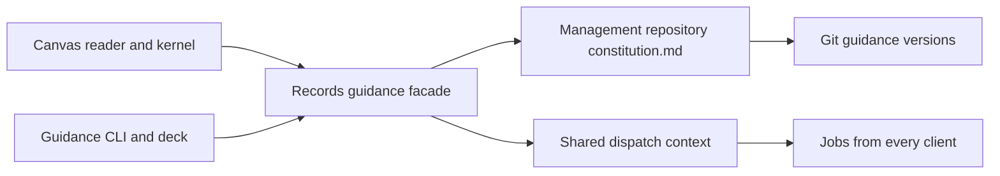

# Canvas space guidance uses the project constitution

Status: proposed for acceptance, implemented in the canvas-charters checkout.

The canvas space is a Fleet project. Its north star, clauses and decision scope
belong in that project's existing constitution. They do not introduce a second
project charter concept. Epic charters continue to use `charters/<epic>.md`.
This placement was authorized by the task brief and recorded as Fleet decision
`424a33e1-39f3-40c9-8895-c79d5ade72dd`.

The Records facade owns a marked section of `constitution.md`. Its fenced
`fleet-space-guidance` data holds the north star, clauses and decision-scope
table. Clients preserve all prose outside that section. Constitution versions
are the canvas charter version numbers, so an edit through another client makes
a stale canvas write conflict. No client invents a decision scope when the
section is missing.

Legacy canvas snapshots are copied, oldest first, into new constitution
versions on first canvas access. The current legacy value is included when it
is not already the final snapshot. Original rows and snapshots remain as an
inert archive. A pre-existing shared section wins over legacy data; migration
never overwrites guidance already authored through Fleet. This is intentionally
non-destructive. No live controller migration is performed by tests.

The canvas repository rejects new charter records and versions. The kernel
keeps only a temporary projection during an operation and saves charter changes
through Records. Reader history uses Records history. Dispatch continues to pin
the constitution and nearest epic charter using the existing context service.

The integration checks cover migration history, surrounding prose, repeated
reads, stale editors, cross-client decision checks, dispatch exports, full
constitution and epic guidance in canvas briefs, and forbidden private writes.
The browser check covers editing and reading the shared constitution.

This change does not resolve the separate canvas workflow, scheduler, item
progress and run-state ownership questions. Those require a bounded follow-up
proposal under the constitution's model-change escalation rule.
