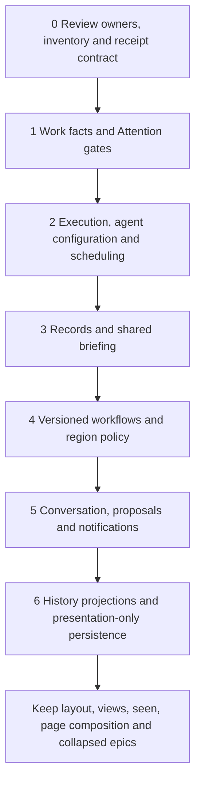

# Canvas state ownership audit

The canvas has **20 record kinds besides the legacy charter and five tables**.
Keep its display composition, personal read position and layout. Move the
business portions behind authoritative Fleet capabilities: execution, work,
attention, authored records, and reviewed workflow, scheduling and proposal
services. Several records need a field split rather than a wholesale move.
This document proposes that order. It migrates nothing.

Audit baseline: `7b12373`, 2026-10-06. This is a source inventory, not a query of
the user's live store. The generic repository accepts arbitrary kind strings,
so historical or externally inserted kinds cannot be ruled out by source alone.
No worker-local store was created. Charter placement and its implemented
migration are covered by [ADR 0011](../adr/0011-canvas-shared-guidance.md).
The classification and proposed order are recorded as Fleet decision
`7bde203b-c4ba-42e5-bf34-df520d3540ea` on work item
`830cdcc7-297f-489a-bd7f-363d97fe82fd`.

## Classification rule and source paths

Presentation state changes how a person reads or arranges authoritative data.
Business state changes what work means, what an agent receives or may do, what
runs, or what must be approved. A proposal below names an intended owner; it
does not assert that a suitable service already exists. The canvas kernel is
inside the Fleet library, so this is a concept-ownership audit, not a claim that
all its persistence lives in browser storage.

Source abbreviations used in every inventory row:

- **O**: `packages/fleet/src/fleet/modules/canvas/application/operations.py`
- **K**: `packages/fleet/src/fleet/modules/canvas/application/kernel.py`
- **T**: `packages/fleet/src/fleet/modules/canvas/application/tick.py`
- **R**: `packages/fleet/src/fleet/infrastructure/sqlite/canvas.py`
- **M**: `packages/fleet/src/fleet/infrastructure/sqlite/migrations/__init__.py`
- **F**: `packages/fleet/src/fleet/modules/canvas/facade.py`
- **A**: `packages/fleet-web/src/fleet_web/static/js/canvas/app.js`

## Every other canvas_record kind

**P** means presentation, **B** means business, and **mixed** requires a split.
The retained presentation fields must never become authoritative work facts.

| Kind | Classification | Evidence and concrete example | Proposed ownership |
| --- | --- | --- | --- |
| `attn` | B; duplicates Attention and carries workflow routing | K:434 stores `fleet`, `kind`, `stage`, `item`/`epic`, question and reason; T:182 adds a run-linked `Unblock`. An `Approve` row points at a separate Fleet attention item. | Attention owns identity, question, owner and resolution; the workflow service owns the gate-to-attention reference. Canvas derives cards from those services. |
| `block` | Mixed; business draft plus layout | O:757 stores proposed stage `code` and author alongside `x`, `y`. Dragging a drafted test stage into the workflow installs executable rules at O:792. | Proposal/workflow draft owns code and provenance; canvas keeps the draft card's coordinates. |
| `context` | B; agent-input policy | O:1040 stores a document/view reference, region, actor and time. O:1196 includes a referenced spec in every space agent's brief. | Records/context composition service owns the versioned references and inclusion policy; all dispatch clients consume it. |
| `epic` | Mixed; workflow/approval plus appearance | K:192 stores `stage`, `approved`, `color`, `ref`. An epic can be in `shape` and unapproved independently of its Work record. | Work/workflow owns lifecycle and approval; canvas keeps color and a derived display reference. |
| `epicflow` | B; lifecycle policy | O:68 stores `defaults.EPIC_WORKFLOW`, version and authorship. O:682 can recreate it during compilation. Its stages govern when child tasks may dispatch. | Fleet workflow capability owns epic definitions, versions and gates. |
| `guidance` | B; instructions separate from Records guidance | O:616 stores targeted text, author and source message. O:1165 includes "Prefer small commits" for a task in the canvas brief. | Shared Records/work briefing service owns scoped task/epic instructions and provenance; canvas projects them. |
| `item` | Mixed; predominantly business facts | K:180 stores `stage`, `band`, `region`, `owner`, `budget`, `priority`, pause state, workflow pin, criterion coverage, builder and revision/evidence/approval `facts`. A pinned revision's tester evidence decides a stage exit at K:295. | Work owns assignment, priority, evidence and acceptance; workflow owns stage, pin and gates; Execution/control owns run pause semantics. Preserve presentation grouping only where it has no scheduling effect. |
| `message` | B; durable conversation and responder state | O:601 stores user text/target/time; O:608 stores pending question, reply identity, proposals and status. A pending responder reply is resumed or failed by `services/canvas_responder.py:39`. | Fleet conversation/responder capability owns messages, reply status and provenance; canvas keeps only panel arrangement and transient input drafts. |
| `note` | B; operational notification, not a sticky-note view | K:388 stores emitted text, rule source, time and work subject; O:1091 deletes it on dismissal. For example, a rule emits "New in Inbox" after work placement. | Fleet notification/activity service owns occurrence and per-person dismissal; reserve Attention for notifications requiring an action. |
| `page` | Mixed; reader composition with possible authored content | O:77 stores default page Markdown; O:1077 saves an edited document. `::epics` order is presentation, while free text describing a business decision is authored content. Page Markdown itself is not injected by the brief builder at O:1191. | Keep reader directive order/appearance in canvas preferences. Move substantive prose to Records and reference it from the page. Do not classify every editable page as a spec, or every prose paragraph as layout. |
| `proposal` | B; durable proposed commands and adoption state | K:666 stores `operations`, `state`, author, subject and conversation. O:664 records adoption after applying proposed operations. For example, an epic decomposition proposes child-task creation. | A reviewed Fleet proposal/decision capability owns immutable proposed operations, authority, adoption/refusal and resulting work links. Attention can expose approval; it is not a substitute for proposal execution. |
| `region` | Mixed; policy bound to geometry | O:341 stores `code`, `level`, version and authorship with `rect`, `color`. An enforced "Inbox" capacity/entry rule governs placement; a label-only region changes appearance. | Workflow/context services own applicable membership, scope, capacity, entry/exit rules and versions. Canvas keeps geometry/color and label-only visual regions. Define how drag operations request business membership changes before splitting. |
| `run` | B; parallel Execution lifecycle | K:324 creates a separate queued run with `fleet_run=None`, agent, retry/cancel/permit fields and outcome. T:131 reads the linked Fleet run; T:145 then calls canvas `finish`. | Execution owns actual runs and their observed status; workflow/control owns dispatch requests and retries before a run exists. Canvas projects either request or run, with distinct identities. |
| `schedule` | B; scheduler policy | O:66 stores code/version; O:682 edits it through compilation. T:310 selects queued runs, so this is operational policy, not the order of displayed cards. | Fleet scheduling/control owns capacity, eligibility, ordering and adopted policy versions; canvas edits through that facade. |
| `seen` | P | O:1064 records the person's last viewed event `seq` and time, marking the write as presentation. Seeing sequence 42 changes the "since last visit" display, not Attention resolution. | Keep as a personal canvas reading preference. Do not reinterpret it as business acknowledgment or approval. |
| `settings` | B; dispatch configuration and permissions | O:1098 stores named agents' host, cwd, runtime, permission/model or simulated duration; O:79 includes `allow`. `services/canvas.py:266` builds dispatch requests from them, and `:317` retains future-run permission rules. | Fleet agent/dispatch configuration and authority services own profiles and grants. Simulation settings belong to an explicit library/test mode, not a second production agent registry. |
| `spec` | B; authored work document | O:1084 stores text/version; O:1197 includes it in agent context. For example, "The webapp keeps pgvector" changes how the agent implements the task. | Records owns the versioned spec; Work owns criteria and links to that document. Canvas is an editor and reader. |
| `stage` | B; executable workflow definition | O:59 stores default stage code; O:792 adopts drafted code. K:293 evaluates "revision submitted" and K:297 evaluates "you approve" as exit gates. | Fleet workflow owns definitions, versions, entry actions and exit contracts. Display name and order remain projections of that definition, not a separate mutable lifecycle. |
| `view` | P for display configuration; mixed when its text becomes context | O:973 stores type, filters/options, title, code, text, personal owner and coordinates; its creation log says it "reads records and changes nothing". However, O:1202 adds `view.text` to briefs when a `context` reference selects it. | Keep board/metric/swimlane/widget configuration and layout. A note/document view's text used as agent input becomes a Records document with a context reference; canvas retains the view of it. View code does not execute workflow operations. |
| `workflow` | B; adopted task lifecycle and version history | O:64 stores stage order and `history`; K:451 chooses a pinned version. Moving through Plan → Implement → Approve changes dispatch and gates, not merely the board layout. | Fleet workflow owns the adopted definition and migration/pinning policy; canvas projects columns and requests transitions. |

There is no additional persisted `agents`, `decision`, `layout`, `collapsed_epics`
or `thread` **kind** in the current writers. Named agents are fields in
`settings`; decisions use `ports.decisions`; layout has its own table; collapsed
epics are a browser preference. The responder starts a thread through its
client rather than persisting a canvas thread kind. This distinction prevents
an API/view label from being mistaken for another stored model.

The `charter` kind is the already-addressed exception. F:23 ignores its archived
rows and reads Records; F:57 routes edits to Records; R:29, R:49 and R:58 reject
new private charter writes. Its old rows/versions remain retained evidence.

## Every canvas table

All five are declared in M:168–183. An envelope's name does not determine
whether its contents are presentation or business state.

| Table | Classification | Evidence and example | Proposed disposition |
| --- | --- | --- | --- |
| `canvas_record` | Mixed envelope | M:168 keys JSON by `(space, kind, id)`; R:19 loads every kind without a whitelist. The same table holds a `seen` preference and a business `run`. | Move business rows through the selected owner facade; retain approved presentation kinds or extract a presentation store. Keep legacy rows inert until acceptance of migration evidence. |
| `canvas_version` | Mixed history; business history for policy/doc kinds | M:171 keys snapshots by kind/id/version; R:61 writes them. `stage` v2 is a business policy version; `view` v2 can be a filter configuration version. | Preserve business history and source-version mappings in the owning capability; presentation history may stay if useful. Do not erase the charter archive or renumber history silently. |
| `canvas_event` | B; audit/activity history, not layout | M:174 declares the log; M:176 and M:178 prevent updates/deletes. R:71 appends actor/source-line/operation events, for example "dispatch builder requested". | Fleet activity/history service owns business event identity and provenance; canvas reads a filtered projection. Retain immutable historical events and source sequence mappings. A view-change event can remain presentation telemetry, clearly typed. |
| `canvas_op` | B infrastructure; durable command idempotency | M:180 records operation ID, project, name and result; R:87 replays it; F:38 checks it before applying operations. Retrying an adopted proposal must not create its children twice. | Fleet command/application boundary owns operation keys, receipts, refusals and replay scope. Coordinate with Execution's action idempotency rather than assuming those keys already mean the same thing. Keep receipts through cutover and test crash/retry behavior. |
| `canvas_layout` | P | M:181 keys values by `(space, person, object)`; R:106 writes layout props. Two people can position the same task card differently. | Keep. Restrict props to position/size/appearance; never store priority, approval, agent configuration or dispatch eligibility here. |

Browser persistence is also P. A:33 stores pan, zoom, mode and collapsed epics:

```javascript
localStorage.setItem(STORE_KEY, JSON.stringify({ pan: ui.pan, zoom: ui.zoom, mode: ui.mode, collapsedEpics: ui.collapsedEpics }));
```

That is a permitted remembered view. Business gestures go through the canvas
operation service at A:115. No change to those preferences is proposed.

## Evidence for the ownership boundaries

The important distinctions are behavior, not field names. These source excerpts
were read with `nl -ba <file> | sed -n '<start>,<end>p'`.

K:434 and T:79 show why `attn` is more than a visual card: it links a Fleet
attention item and can create another one after resolution without an answer.

```python
self.put("attn", attn_id, {"id": attn_id, "kind": "Accept" if is_epic else "Approve", "text": question,
                           # ...
                           "fleet": fleet_item.id, "time": iso(self.now)})
# tick.py:79
record["fleet"] = self.raise_approval(attn_id, record["text"], subject, bool(record.get("epic"))).id
```

K:388 distinguishes emitted `note` notifications from a view that displays a
person's sticky note. Dismissing these is currently a record deletion at O:1091.

```python
self.put("note", note_id, {"id": note_id, "text": arg, "why": f"{src} · line {line.n}",
                           "time": iso(self.now), "subject": identity})
```

K:180 and K:462 demonstrate that item/workflow state has business consequences.
Entering `done` can write the authoritative Work condition. The audit identifies
the code path; it does not claim a reproduced live acceptance bypass.

```python
"facts": {"submitted": False, "revision": None, "evidence": {}, "approved": False},
# kernel.py:462, inside the stage == "done" branch
self.items[identity] = self.ports.work.set(identity, actor=self.actor, condition="complete",
                                         next_step=None)
```

O:341 puts both policy and rectangle into a region. A region used only as a
label has no business effects; an enforced region does.

```python
self.put("region", identity, {"id": identity, "name": name, "code": code, "level": level, "version": 1,
                              "rect": rect, "color": args.get("color"), "written_by": author,
                              "adopted_by": self.actor, "created_at": iso(self.now)})
```

O:1200 explains the conditional business classification for a view's text.
For example, a note saying "Reuse the warm image" becomes an agent instruction
when dropped into the context region, even though the view itself remains a
presentation widget.

```python
elif entry["kind"] == "view":
    view = self.get("view", entry["doc"]) or {}
    lines.append(f"- {entry['title']}: {view.get('text') or ''}".rstrip(": "))
```

O:1077 explains why the reader page needs a split rather than being declared
entirely business or presentation:

```python
page["markdown"] = markdown
page["version"] += 1
self.log(self.who_source(), 0, "reading page rearranged", "info")
```

Its directive arrangement is reading composition. Any durable business prose
in that Markdown belongs to Records even though this writer calls the edit a
rearrangement. Likewise, R:52 calling a write `record_observation` does not
turn substantive `view.text` into presentation state.

## Proposed migration order

This is a proposal awaiting acceptance and a separate premise review before
dispatch. New workflow/conversation/proposal concepts require model review under
the constitution. Do not dispatch this list as an implementation plan merely
because the audit job succeeds.

| Order | Scope and dependency | Concrete acceptance example |
| --- | --- | --- |
| 0 | Accept an owner/field map, identify actual controller-store kinds read-only, pin versions and preserve archive mappings. Define which services already exist and which are proposals. Establish a shared command receipt/history contract for subsequent cutovers. | An inventory lists every live kind and every legacy run/gate/document reference without changing the store; unknown kinds stop automatic cutover. |
| 1 | Move `item`/`epic` business facts and `attn` gate bindings to Work, Attention and the approved workflow contract. Make acceptance explicit; retain display color, derived labels and purely visual grouping. This comes first because K:462 writes Work completion. | Resolving an approval from CLI/deck/canvas addresses one Attention item and one gate; run success alone cannot complete work or accept criteria. |
| 2 | Reconcile `run`, operational `settings`/agents and permission grants with Execution/control/configuration. Model a dispatch request separately from its actual run. Move scheduling eligibility with this owner; split `schedule` policy from its canvas editor. | One dispatched job has one Fleet run across clients; retry after uncertain dispatch does not create a duplicate; grants apply with the same scope outside canvas. |
| 3 | Move `spec`, targeted `guidance` and business `context` references to Records and shared briefing. Split context-bearing `view.text` and substantive `page` prose into authored documents. | Dispatching the same task through CLI and canvas yields the same pinned spec, task instructions, constitution and epic charter; rearranging reader directives changes none of them. |
| 4 | Introduce or adopt the reviewed workflow owner for `workflow`, `stage`, `epicflow`, policy-bearing `region`, and remaining scheduler definitions. Move business `block` drafts through the proposal/workflow service. This depends on authoritative work/run/context commands from steps 1–3. | A task pinned to workflow v2 observes the same exit rule from every client; moving a rectangle does not change capacity or membership policy. |
| 5 | Move `message`, `proposal` and operational `note` occurrences to the approved conversation/proposal/notification services. Preserve who proposed what and which operations were adopted; retain per-person presentation/dismissal preferences separately. | A proposal created in chat is reviewable elsewhere; replaying its adoption creates children once; an informational notification can be dismissed without resolving a required decision. |
| 6 | Finish table cutover: owner histories replace business `canvas_version`; shared audit projections replace business `canvas_event`; shared command receipts replace business `canvas_op`. Enforce a presentation-only kind/field registry for remaining `canvas_record` data. Retain `canvas_layout`, display-only `view`, `seen`, page composition and browser preferences. | Architecture tests reject business fields in presentation persistence; historical versions, events and operation receipts remain addressable through source-to-owner mappings. No archive deletion is part of this proposal. |

History and idempotency are preserved during **each** owner migration; step 6
finishes routing and enforcement, rather than postponing recovery semantics.
The exact services for the proposed concepts remain a design decision. They
must expose commands through Fleet facades; clients do not reach hosts or SQL
around them.



## Inventory verification and limits

Read commands:

```sh
rg -n 'self.put\(' packages/fleet/src/fleet/modules/canvas/application/{kernel,operations,tick,orchestrator}.py
rg -n '\.put\(|\.save\(|records\[' packages/fleet/src/fleet/services/canvas*
rg -n 'CREATE TABLE.*canvas|canvas_(record|version|event|op|layout)' packages/fleet/src/fleet/infrastructure
```

An AST scan of literal `put` calls in the canvas module gave this complete
kind inventory; inspection of O:682 resolves its dynamic writer to `schedule`
or `epicflow`, both already included. The service writer at
`services/canvas.py:317` adds only the already-listed `settings` kind.

```text
attn block charter context epic epicflow guidance item message note page
proposal region run schedule seen settings spec stage view workflow
All literal writer kinds: 21; other than charter: 20
Canvas tables: canvas_event, canvas_layout, canvas_op, canvas_record, canvas_version
```

No other table declarations beginning `canvas_` occur in the migration source.
The full line-numbered scan is retained in this job's
`outbox/canvas-state-audit-evidence.txt`. A read-only controller inventory, if
required before migration, should run these queries against its authoritative
store, not a new local database:

```sql
SELECT kind, COUNT(*) FROM canvas_record GROUP BY kind ORDER BY kind;
SELECT name FROM sqlite_master WHERE type = 'table' AND name LIKE 'canvas_%' ORDER BY name;
```

This documentation follow-up changes no runtime code or stored state. Validation
is inventory-to-table coverage and `git diff --check`; rerunning browser or
application suites for this document would not add ownership evidence.

## Work-state handoff

Evidence: this classification, source lines and excerpts, AST/table inventory,
and the earlier implementation report and verification for commit `7b12373`.
Remaining work: separate acceptance of the charter implementation and this audit,
then model review and premise review of any selected migration proposal.
Next step: the controller reviews this document, records an authoritative
condition and next step, and decides which bounded follow-up to commission.
Proposed work condition: **ready for review**. This successful job does not
complete work, accept criteria or authorize the proposed migrations.
