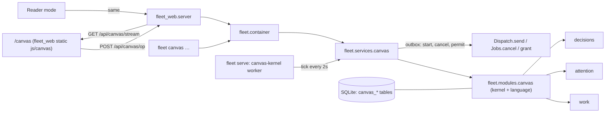

# The canvas and the decision language

The canvas is a second way into the deck. It is at `/canvas` in `fleet web`. It shows one project's work as a
workflow board, with priority bands, regions, epics, documents and views. Every rule on it is a short snippet in
Fleet's decision language: stage, region, epic workflow, view, schedule and reading-page code. You can read, edit and
version these snippets. The kernel runs them; agents interpret and cite whatever it cannot run.

This document records how the design (the *Canvas to Fleet: operation contract v1* and *Fleet decision language:
vocabulary v1*) was built, what each part maps to in Fleet, and what is still open.

## Shape



- **`fleet.modules.canvas.domain.language`** is the compiler. It reads stage, zone, epic workflow, schedule and view
  snippets line by line, and each line comes out compiled (✓), guidance (~) or off (·). A missing or changed header
  is the only thing that fails to compile. An operation written in a section where it is not allowed becomes
  guidance, with a note saying where it is valid.
- **`fleet.modules.canvas.application`** is the kernel. `Kernel` holds a loaded space. `Ticking` adds the tick: adopt
  new work, sync answers and runs, advance, run the epic workflow, pull, and schedule. `Engine` adds the operations.
  `orchestrator` writes the deterministic replies to the message bar. `view` builds the read model.
- **`fleet.infrastructure.sqlite.canvas`** stores the space in five tables:
  - `canvas_record` holds the current records. Each change has a `state_history` entry under
    `canvas:<project>:<kind>:<id>`.
  - `canvas_version` holds every compiled version.
  - `canvas_event` is the append-only event log. Triggers refuse updates and deletes.
  - `canvas_op` holds idempotent operation results.
  - `canvas_layout` holds personal layout.
- **`fleet.services.canvas.CanvasService`** is the one write path for every client. It runs an operation in one
  controller transaction. A refusal rolls the transaction back and is then written to the event log on its own. The
  service also carries the kernel's outbox to hosts, outside any transaction.
- **`fleet serve`** runs a `canvas-kernel` worker beside its other workers. With no hosts configured it still starts
  when the store has a canvas, so simulated agents and schedules keep moving.

## Records

A canvas belongs to a registered project: the *space* is the project. Work items, criteria, dependencies, attention
items and decisions are Fleet's own records. The canvas adds only what Fleet had no place for.

| Contract record | Where it lives |
|---|---|
| Project | The workspace project. Its charter, schedule and settings are canvas records. |
| Work item | Fleet `WorkItem`. Cards are the project's non-epic items, and an epic is a `kind=epic` item. A card's stage, band, region, owner, budget, priority, pin, facts (submitted, revision, evidence per check, approved) and the epic criteria it covers are its `item` record. |
| Acceptance criteria | Fleet `Criterion` records. `criteria.set` adds and withdraws them (a new `WorkFacade.remove_criterion`). |
| Dependency | Fleet `depends-on` relations. `dep.add` checks for cycles, and `dep.remove` uses the new `WorkFacade.unrelate`. |
| Job, run and step | A canvas `run` record (queued, starting, running, struggling, blocked, paused, succeeded, failed or stopped, each with a reason) linked to the Fleet `Run` that the dispatch created. |
| Decision | Fleet `Decision`, recorded by `decisions.answer` with the actor that sent it. |
| Attention item | Fleet `AttentionItem` (source `canvas`). The canvas keeps a link record naming the stage and line that raised it. |
| Constitution | The canvas `charter` record: north star, clauses (enforced by a named kernel rule, or guidance) and decision scope. Each change makes a new version. |
| Page | The canvas `page` record: Markdown plus `::directive` lines. |
| Event log | `canvas_event`: time, actor, source object and version, line, text, tone, subject and operation id. |
| Code objects | `stage`, `region`, `schedule`, `epicflow` and `view` records, each with `code`, `version`, `written_by` and `adopted_by`. Old versions are kept in `canvas_version`. |
| Layout | `canvas_layout`, per person. It is unversioned, unlogged and last-write-wins. |

## Operations

Every operation in the contract is implemented, under its contract name. All of them go through
`POST /api/canvas/op {space, op, args, op_id}`, `fleet canvas op SPACE OP --args JSON`, or
`container.canvas().operation(...)`. The table names each operation by its contract call; the operation name
is the part before the bracket.

| Contract operation | Notes |
|---|---|
| `item.move(item, stage)` | Refuses skipping a stage (`stage_skipped`), a stage outside a pinned version, and unmet exit conditions (`exit_condition_unmet`, with the stage, version and line). Moving back is always allowed. |
| `item.set_band(item, band)` | Band limits come from the schedule (`capacity_full`, schedule line). |
| `region.enter` / `region.exit` | Capacity limits (`capacity_full`) and documents-only regions (`wrong_kind`). Runs the region's on-enter and on-exit code. An agent actor gets `not_permitted` where the region says `may not move items out`, and a proposal where it says `may propose entry`. |
| `item.reparent(item, epic)` | Checks for cycles. Warns that the card covers none of the new epic's criteria. `item.cover` maps a card to epic criteria. |
| `run.request(item, role)` | Queues the run. Stage `dispatch builder` and `dispatch tester` lines call it. |
| `run.start(run, agent)` | The scheduler does this every tick. The manual form checks capacity, dependencies and tester independence. |
| `dep.add` / `dep.remove` | `cycle` |
| `attention.resolve(id, choice)` | Records the decision with the actor, then approves (satisfying `you approve`) or sends the work back. Only a person can answer an Approve or Accept; an agent is refused with `not_permitted`. Approvals answered elsewhere (the deck, `fleet answer`) are applied on the next tick. |
| `run.pause` / `resume` / `permit(scope)` / `reassign(agent)` | Pausing cancels the job (`fleet cancel`). Resuming re-queues it. Permitting grants the run's refused rules: with `space` the rules are also added to future dispatches in this space; there is no `everywhere` scope until Fleet has a shared rule to hold it. Only a person can permit. Reassigning stops the run and queues it for the other agent. |
| `message.send(target, text)` | Stores the message. An instruction is stored as guidance on its target. The orchestrator replies from records and offers proposals. |
| `proposal.resolve(id, adopt)` | Applies the proposal's operations in one transaction. |
| `region.propose(rect, name)` then `region.create` | The name is interpreted as code (`defaults.zone_code`). You adopt it as enforced, guidance or label. |
| `code.compile(object, text)` | The header must not change. A stale `base` gets `version_conflict` with the current record. |
| `workflow.insert(block, index, migration)` | `stage.draft` drafts the block. Work past the insertion point is moved (`move`) or pinned to the old version (`pin`). |
| `criteria.set(item, list)` | Changed criteria lose their evidence. The spec version goes up. |
| `charter.update(patch)` | A new charter version. `decision.check(kind, rule)` answers decide, tell or ask, and reports `rule_outranks_scope` when an enforced clause's rule outranks the scope. |
| `epic.decompose(epic)` | Proposes a child task for each epic criterion that no child covers. |
| `view.place` / `configure` / `remove` | Views only read records. |
| `context.add(space, doc)` | Only into a region whose code says `add to context`. Agents in the space read it in their brief. |
| `reader.mark_seen(person)` | |
| `layout.set(person, object, props)` | Also available as `POST /api/canvas/layout`. |

Additional operations, needed to make the prototype work:

- `item.create`, `epic.create`, `region.configure` and `region.remove`.
- `stage.draft`, `page.update`, `spec.update`, `note.dismiss` and `agent.configure`.
- `attention.answer`, `attention.allow` and `attention.dismiss`. These handle a blocked step's reply and a job's
  refused permissions, which reach the host.
- `space.init` and `tick`.

Refusals have the contract's shape:

```json
{"refused": true, "code": "exit_condition_unmet", "source": {"object": "stage plan", "version": 1, "line": 5},
 "condition": "spec has acceptance criteria", "message": "…", "op_id": "c-7f3a"}
```

They are written to the event log with tone `refuse`, so they appear in the runtime log and in since-last-visit.
Their op ids are remembered, so a retried gesture gets the same answer. The web answers a refusal with HTTP 409, and
`fleet canvas` exits 3.

## Runs: scheduler and dispatch

Dispatch is a request. Stage code queues runs. Each tick, the scheduler orders the queue: by band, then priority, then
time queued. It holds a run back for any of these reasons, and the reason shows on its card:

- the work it depends on is not done (`respect: dependencies`);
- its epic is still in Shape and the epic workflow dispatches children only in Deliver;
- the agent has no free slot;
- the tester must be independent of the builder;
- no host is set up for the agent.

An agent named in the schedule runs work in one of two modes, set with `fleet canvas agent` or from the Scheduler
panel:

- **dispatch**: `DispatchRequest(host, cwd, runtime, permission, model)`. The run's id is the idempotency key and
  the job id, so a retried start never starts twice. The step prompt is the run's *brief*:
  - the goal and criteria;
  - the role's instructions;
  - every guidance line that applies, each with its source (`[stage implement v2, line 4] use the warm image`);
  - the charter's rules and decision scope;
  - the documents placed in context.

  A failed start is retried a minute later, and the error is the queue reason.
- **simulate**: the run succeeds after N seconds. `fleet canvas init --example` uses this, so the canvas can be
  tried without a host.

A run's state follows its Fleet run:

- `running` becomes *working*, or *struggling* or *blocked* while the run has open attention (refusals, or a question).
- `succeeded` submits a revision (builder) or captures evidence on the current revision (tester).
- `failed` runs the stage's `on fail` code. A step that ended `FLEET_STATUS: blocked` is blocked, not failed.

## Answers to the contract's open questions

- **One event log?** Fleet already had one audit trail, `state_history`, and the canvas changes are part of it. The
  canvas's `canvas_event` log is the runtime log that the contract describes (actor, source object, version, line). It
  is append-only, and it records refusals and guidance as well as changes.
- **Splitting `fleet send`.** `fleet send` is unchanged. The canvas's request is a canvas `run` record, and its start
  is a `Dispatch.send`. Existing CLI use is unaffected.
- **Floors.** Floors stay a project WIP limit. Agent capacity is the schedule's `capacity:` section. Hosts are per-agent
  settings.
- **Where code lives.** In the controller store, versioned (`canvas_version`). The management repository still holds
  the documents Fleet authors. Code could be mirrored there later, as pages are.
- **Agents on other hosts.** Agents reach the canvas through their brief, which is written into the step they receive.
  They answer through `FLEET_STATUS` and attention, as before. `fleet canvas can SPACE KIND` lets an agent that has
  the controller CLI ask what it may decide.
- **Authority.** People (`user`, `web-user`, `user:*`) may do everything. Other actors are agents, and regions limit
  them (`may not move items out`, `may propose entry`). Scope checks are advisory (`decision.check`); the existing
  mandate and activation checks still govern orchestrator writes.

## What is not built yet

- The orchestrator's replies are deterministic and written from records, not by a model. Decomposition proposes one
  child per uncovered criterion rather than asking an agent. `dispatch decomposer` uses the same proposal.
- Candidate vocabulary (overnight windows, `notify <person>`, `set model`, `require gate`, stage WIP limits and
  checkpoints) compiles as guidance, as the vocabulary says. None of it has kernel behaviour yet.
- A message to a running agent is stored as guidance for its next step. It does not interrupt the step in progress.
- Pause is a cancel, and resume is a fresh run of the same role. Fleet has no suspend.
- A run's spend comes from `usage.cost_usd` when the runtime reports it. Budgets pause work when the reported spend
  reaches them.
- The deck is single-person: every web write is `user`. Personal layout and views are keyed by person, ready for more
  than one.
