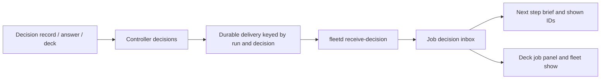

# Decisions delivered to running jobs

The controller delivers immutable decision copies through the existing durable execution delivery queue. The worker never reads the controller store. Dispatch pins the IDs already recorded and a timestamp and includes earlier decisions on the linked work and all ancestors in the initial prompt. Reconciliation selects decisions absent from that snapshot, including during dispatch transport, and queues one delivery per decision and run. Unreachable hosts leave pending intent for subsequent reconciliation.

Worker receipt is independent of agent activity and idempotent by decision ID. At step start, under the job lock, fleetd snapshots unshown decisions into the persisted step prompt, records their IDs, and writes the readable brief. Decisions arriving afterwards wait for the following step. Provider retries reuse the same prompt. Receipt and shown state remain auditable in job summaries. The queue acknowledges receipt, not agent consumption. The deck joins controller intent with worker receipt so pending delivery remains visible while a host is unreachable.

Existing blocked-answer delivery remains a separate transport operation. Jobs without new decisions show a zero count. Previously dispatched jobs without a pinned snapshot use their observed start time; unknown start times cannot establish a reliable boundary and are skipped until observed.
