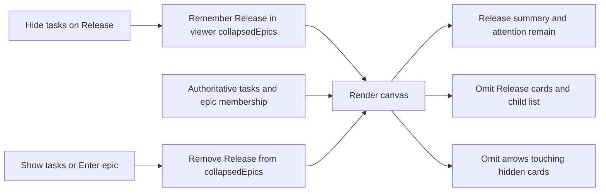

# Manage an epic as one canvas object

Each epic has a reversible Hide tasks / Show tasks button. Hiding leaves the epic visible with its current progress, working and waiting counts, and attention badge. The choice belongs to the viewer, using the existing project-scoped localStorage record. It never changes work conditions, membership, acceptance or running agents.

For example, hide Release with two children: Release remains visible, both task cards and its child list disappear, and a "2 tasks hidden" label explains the result. Tasks in Other epic and tasks without an epic remain visible. Show tasks restores the cards at their original positions. Enter epic also expands its tasks.

## Implementation boundaries

`packages/fleet-web/src/fleet_web/static/js/canvas/app.js` owns viewer state and toggle gestures. `render.js` reads that state and current `item.epic` membership. No kernel operation, schema change, owner interface or deployment is needed.

The toggle is available at every supported zoom. Its label names the action and task count; `aria-expanded` exposes the current state. Hiding a selected task selects its epic instead and cancels a dependency gesture originating at a hidden task. Incoming live updates still update the epic's aggregate status. Newly added children of a collapsed epic are hidden too because rendering uses current membership.

Task inspector, reader documents and attention retain access to task information. This is a canvas overview preference, not a restriction on finding or managing work. Dependency arrows touching a hidden task are omitted rather than pointing into empty space. Aggregate epic dependency arrows are outside this change.

## Verification and acceptance

`tests/test_web_canvas.py::test_collapsed_epic_render_hides_only_its_tasks` runs the real renderer over an isolated HTTP model. It covers two children, another epic, a loose task, an outgoing hidden dependency and an unrelated dependency.

`tests/test_web_canvas.py::test_epic_task_toggle_persists_and_expands_on_enter` drives Hide tasks, reload, Show tasks and Enter epic in Playwright. Run it on home with `--shots` to capture collapsed and expanded states. Browser verification and screenshot review are required before this visible change is ready for review.

The brief's explicit request to hide tasks overrides the constitution's general prohibition on hiding to reduce noise. Status and attention remain visible on the epic, and expansion restores detail. The charter permits implementation inside a module; architectural and owner-interface changes are avoided.
