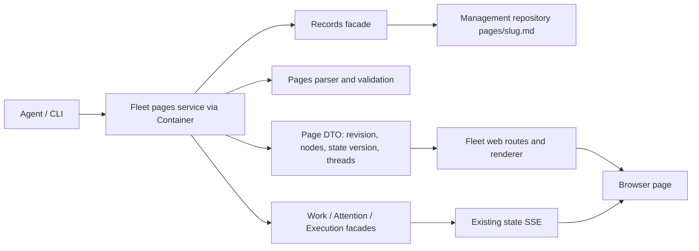

# Live pages: decisions for v1

Live pages realise **Space** as authored views over shared project records. Markdown is versioned in the project's management repository; directives read accepted work, attention and runs; comments are attention items and answers are Decisions. M0 is this proposal; implementation is M1–M3, with agent auto-replies deferred to M4. No second writable copy of project state is introduced.

## Page identity, model and storage

A page is `(project UUID, slug)`, addressed as `fleet://projects/<project-uuid>/pages/<slug>`. Slugs match `[a-z0-9]+(?:-[a-z0-9]+)*`; the only storage path is `pages/<slug>.md`. Renaming creates another page address; existing comments retain their original address. v1 has no rename or deletion operation. The first Markdown heading supplies the title; absent headings show the slug as the explicit identifier, not an invented title. No front matter is required: project identity comes from repository registration, format version from the pages parser contract.

Author through a new pages facade, with project, slug, body, request key, actor, optional source run and expected confirmed revision. Reject stale revisions before writing, under the same repository lock; do not overwrite a concurrent author. Reuse Records' intent, serialization and provenance contract. Read only confirmed revisions. A working-tree edit cannot alter the live page. Historical `?revision=<commit>` pins prose and anchors; label directives as **current records** even in a historical page (v1 does not reconstruct old controller state).

Existing mechanism: `packages/fleet/src/fleet/modules/records/facade.py:39` delegates authoring; `:65` reads the confirmed revision:

```python
record = self.repository.current(project, path)
return self.writer.read(self.workspace.management_repository(project), path, revision or record['revision'])
```

`packages/fleet/src/fleet/modules/records/application/__init__.py:45` serializes writes and rejects changed idempotency payloads. `packages/fleet/src/fleet/infrastructure/git/__init__.py:36` rejects traversal and repository escapes; `:75` refuses dirty trees and commits `Actor` and `Source-Run` provenance. Extend that seam for the atomic expected-revision check rather than checking in a client.

```python
with self.writer.lock(root):
    # compare expected confirmed revision here, before preparing the write
```

Example: author `pages/supplier-migration.md` with source run `R`, then modify the working file. GET still returns the confirmed commit; a write based on the previous commit conflicts visibly.

## Library boundary and rendering contract

Add `fleet.modules.pages` with a public facade, domain parser and application ports; assemble its dependencies in Container. A `fleet.services.pages` service coordinates Records, work/run projections and attention through public facades. Expose presentation DTOs/errors through `fleet.api`; fleet-cli invokes providers, fleet_web maps routes and renders DTOs. Parsing, scope validation, selector validation, deduplication and mutations belong in fleet. Clients contain no domain behaviour.

Reuse Container's public facade providers (`packages/fleet/src/fleet/container.py:176`, `:184`, `:196`) and add a pages provider plus public-surface/internal-layer import contracts. `.importlinter:8` places clients above Container, services, projections and modules; `.importlinter:27` forbids modules importing clients, infrastructure or services.



Proposed routes: GET `/api/pages?project=`, GET `/api/pages/<project>/<slug>?revision=`, POST `/api/pages/<project>/<slug>/comments`. CLI `fleet page write` is the authoring entry point; there is no browser editor. The existing answer route handles replies. Missing page/project/revision returns a named error, never a fabricated page.

The library produces typed prose/directive/error nodes with stable directive IDs and resolved DTOs. The web renderer uses trusted templates, not directive-supplied HTML. A failed node leaves readable surrounding prose. Return page revision and monotonic controller state version with every view; discard responses older than the latest request generation. A render must read one controller snapshot for all directives and threads.

## Directive set

Directives occupy a standalone Markdown block outside fenced code. Attributes are a strict whitelist; `id` is a record ID, `block` is an optional author-assigned page-local stable ID. `block` matches the slug grammar, must be unique, and is mandatory before a directive can receive comments. Without it, render the directive but explicitly disable commenting with “Add a stable block ID to comment on this block.” Never anchor by position or generate an ID from mutable content.

| Syntax | Rendered contract | Explicit failure/empty example |
| --- | --- | --- |
| `::work{id=W block=supplier-work}` | Goal, accepted progress with its denominator, next step, named condition and record link | Missing W: `Unknown work item W`; no total: `Progress unknown: no defined total` |
| `::attention{id=A block=supplier-question}` | Headline, owner, state, source/context link and answer box when the existing answer rules allow it | Missing A: `Unknown attention item A`; resolved: show answer and resolution, no active answer box |
| `::runs{project=P since=7d block=supplier-runs}` | Compact run list with status, host, work link and run link; newest first with stable ID tie-break | No runs: `No runs for P in the last 7 days`; unavailable host stays explicitly unavailable |

`since` is required and accepts integer days `1d` through `365d`, measured against run start time at the snapshot's UTC time. Project must be the page's project UUID. Work and attention must belong to that project; cross-project references are rejected. An explicit Markdown link may navigate to another project without embedding its state.

Unknown directives, extra/duplicate attributes, invalid durations, duplicate block IDs, wrong project IDs and unknown record IDs render errors naming the offending token. Reject invalid syntax on authoring as well; rendering still reports it for historical/imported documents. Example `::runs{project=P since=forever}` shows `Invalid since: forever`, not an unbounded list. Markdown inside code fences remains literal.

Rich links use the new strict `fleet://projects/P/pages/slug`, `fleet://work/W`, `fleet://attention/A`, `fleet://runs/R` address grammar. Resolve identities in the library and return trusted internal navigation targets. Unknown addresses remain visibly broken links with reasons. These address handlers are new work, not a claim that current document resolution already supports them.

## Comment-to-attention mapping

**Use `kind=decision`; do not add a comment kind.** A comment asks the selected owner for a response or disposition. Calling it a blocker would falsely claim work cannot proceed; alert would omit the requested response semantics. The UI says “Comment” and “Answer and resolve”; the underlying record remains an ordinary decision request. Existing kinds are fixed in `packages/fleet/src/fleet/modules/attention/domain/__init__.py:7`:

```python
KINDS = ("decision", "blocker", "alert")
OWNERS = ("agent", "user")
```

Create one attention item per submitted comment: project from the page, owner `user` unless reader explicitly selects `agent`, source `page`, source reference `page:<project>:<slug>:<comment-uuid>`, context reference the canonical page fleet address, actor from the trusted caller. Require a separate headline of at most 12 words (existing domain validation at `:119`); preserve the complete comment body. A user-owned submission must state why the user must act; an agent-owned submission records that the reader requested an agent response. Show the owner and consequence before submission.

Add an optional typed `page_annotation` field to AttentionItem and its controller persistence/projection: version, comment UUID, canonical page address, confirmed creation revision, plain-text body, W3C selector and optional parent attention ID. No separate pages thread store, no Git comment log, and no misuse of stream_context/options/context_reference to smuggle JSON. This additive metadata proposal is within the brief's explicit requirement to store selectors with the item; M0 makes the schema change reviewable before M3 implements it. Preserve it through observation updates, owner changes and state transitions; old items load with absent annotation metadata. Create the annotation and attention in one controller transaction.

Deduplicate by source/reference as today (`packages/fleet/src/fleet/modules/attention/application/__init__.py:25`); page creation adds strict payload equality for retries. Same comment UUID and changed body/selector/owner is a conflict, never an update. A lost response followed by retry creates exactly one item. Comment edits and deletion are out of scope.

Replies reuse `DecisionsFacade.answer` (`packages/fleet/src/fleet/modules/decisions/facade.py:101`), which calls the transactional answer path (`packages/fleet/src/fleet/modules/decisions/application/__init__.py:184`):

```python
transaction.insert(decision)
transaction.attention.resolve(item.id, details=f"decision:{decision.id}", actor=actor)
```

One request has one resolving answer, not a general chat transcript. Show its Decision alongside the original comment. A follow-up is a new attention request with parent attention ID, validated against the same page. Existing resolved-item retry rules remain authoritative. Page comments have no run or stream context by default, so answering cannot accidentally resume a job. Selecting owner agent does not itself dispatch one in M3. Delegation of existing items follows the confirmed triage mandate; triage never accepts work or judges completion criteria.

Example: “Should this slice include historical suppliers?” creates decision A; “Only current suppliers” produces Decision D and resolves A. “What about archived contracts?” creates A2 linked to A; D remains visible.

## Anchoring and Recogito boundary

Vendor the latest verified 4.x `@recogito/text-annotator` release at M3 into `fleet_web/static/vendor/recogito/`, including JS, CSS, LICENSE, exact version, checksums and reproducible bundle instructions. No runtime CDN. Existing local-vendor precedent is `packages/fleet-web/src/fleet_web/static/vendor/three/LICENSE`. Upstream's [README](https://github.com/recogito/text-annotator-js) exposes `createTextAnnotator` and `createAnnotation`; its [package metadata](https://github.com/recogito/text-annotator-js/blob/main/package.json) declares BSD-3-Clause. M3 verifies the actual distributable and W3C adapter before selecting the pin; M0 does not vendor or claim browser integration.

Recogito handles selection/highlighting; the fleet library owns durable selector semantics. Prose stores W3C `TextQuoteSelector` (`exact`, `prefix`, `suffix`), optional `TextPositionSelector` as a hint, and creation revision. Quotes refer to the rendered prose text only, excluding directives, buttons and thread panels. Preserve Unicode code points and use one documented whitespace normalization shared by selection and resolution. Positions never override a disagreeing quote.

On a later revision, attach only when the exact quote and context resolve uniquely. Zero matches: `Anchor unavailable: quoted text changed`; several matches: `Anchor ambiguous: multiple matching passages`. Keep both comment and answer visible in an unattached thread list and link to the creation revision. No fuzzy relocation or silent first-match selection. Example: repeating “supplier is active” twice with indistinguishable context makes the anchor ambiguous.

Directive comments store W3C `FragmentSelector` with `value` equal to the explicit page-local block ID, plus creation revision. Their entire trusted wrapper carries that ID; changing live numbers leaves the thread attached. Removed blocks show `Anchor unavailable: block supplier-work removed`. Block IDs must not be repurposed for another record: reject a confirmed edit changing the directive type/target under an existing ID; use a new ID instead. Selection spanning prose and directives, or multiple directive blocks, is rejected with a named reason.

Validate selectors against the submitted confirmed revision; reject unknown selector types, empty quotes, out-of-range positions and nonexistent block IDs. If the current revision changed, retain the validated historical anchor and report its current attachment state; never rewrite it to claim another selection.

## Live update path

Reuse `LiveWorkspace.bump()` (`packages/fleet/src/fleet/services/live.py:75`):

```python
with self.changed:
    self.version += 1
    self.changed.notify_all()
```

Existing `/api/stream` stream emits full `event: state` documents on change (`packages/fleet-web/src/fleet_web/server.py:576`, `:589`). M2 must include an explicit version in that state payload: the present loop tracks a version internally but does not add it to the emitted JSON. Do not interpret pipeline/ping events as accepted-state changes.

```mermaid
sequenceDiagram
  participant C as Library command / ingestion
  participant S as Live state
  participant B as Browser
  participant P as Pages service
  C->>C: Commit records or attention transaction
  C->>S: Invalidate after successful commit
  S-->>B: SSE state + version
  B->>P: Fetch page view, revision + version
  P-->>B: Prose, directive DTOs, threads
  B->>B: Reject stale response; patch stable wrappers
```

All successful page publications, comment creations and answers invalidate after commit; CLI/external-controller writes need the existing ingestion/polling path extended to detect changed confirmed page records. Direct working-tree changes never trigger live prose. Coalesce events, fetch an authoritative snapshot on initial connection/reconnection and on each newer version, preserve scroll and unsent answer text, and update prose only if its confirmed revision changed. Refresh `since` windows when state refreshes and on the service's existing clock/poll cadence; record the snapshot time. Disconnection marks the page stale and disables submission until refreshed. Do not retry a write with a new request UUID.

## Security contract

There is no authentication in the current deck. Its Origin guard (`packages/fleet-web/src/fleet_web/server.py:241`) permits absent Origin and compares netloc, so it is a browser cross-site guard, not an access-control boundary:

```python
return origin is None or urlsplit(origin).netloc == self.headers.get("Host")
```

Keep deployment in the existing trusted local/network boundary; v1 makes no multi-user identity or authorization claim. New browser comment POSTs require an exact matching scheme/host Origin; absent Origin is rejected for that route. Non-browser authors use the CLI/library. This does not authenticate callers or make an exposed deck safe.

Reuse raw-HTML-disabled Markdown (`packages/fleet-web/src/fleet_web/documents.py:22`):

```python
MarkdownIt("commonmark", {"html": False, "linkify": False, "typographer": True})
```

No authored JS, arbitrary HTML, executable directives, event attributes or embedded iframes. Comments render as text. Permit only validated fleet navigation, relative management assets confined to the project root, and http/https links; block javascript/data/file URLs. Templates never interpolate comments/selectors into HTML. New pages are a separate read surface rather than changing deck-wide script policy. Bound bodies to 256 KiB/page, 8 KiB/comment and 16 KiB/selector; cap at 100 directives/page; reject excess with explicit validation errors. Asset reads reuse existing confined document access, not arbitrary filesystem reads. Fetches stay same-origin; browser rendering executes no directive-supplied code.

## Milestones and checkable criteria

| Milestone | Acceptance evidence |
| --- | --- |
| **M1 — page records and library parser** | Public pages facade/service wired through Container and fleet.api; author/read/list use confirmed Git with actor/source-run; stale revision and changed retry payload fail; traversal fails; directive grammar ignores fences and rejects unknown attributes/duplicate blocks; rich addresses resolve or name their error. Tests use temporary Fleet paths. All existing import contracts plus new pages contracts pass. |
| **M2 — live reader and directives** | Browser on home opens one authored fixture with work, attention and runs; missing/unknown data names the cause; cross-project embeds fail; SSE change updates all three without reload, with version/out-of-order/reconnect checks; CLI publication refreshes prose; unsent answer survives updates; historical prose labels live directives; screenshots at desktop and narrow widths collected in outbox. No browser page editor. |
| **M3 — anchored comments** | Local Recogito bundle and BSD license present, runtime works with CDN/network access blocked; prose and directive selections create one attention item each with persisted selector/provenance; reload preserves threads; retry creates no duplicate, changed retry conflicts; response records Decision and resolves item; follow-up preserves prior answer; duplicate quotes/removal surface detached threads; owner selection is explicit; malicious HTML/URL/selector and cross-origin submission tests pass. Browser screenshots on home show anchored and detached cases. |
| **M4 — agent replies (separate runtime dependency)** | Only after headless runtime work item `680c6cb7` is accepted: agent-owned requests activate within a confirmed mandate, correlate page/request/run, and publish answers via existing Decision path. User-owned comments never auto-dispatch. Repeated delivery starts no duplicate run; missing runtime shows named waiting condition; no auto-reply claim before evidence. |

Each milestone commits independently on `feat/live-pages`, runs focused tests, `uv run lint-imports` and `uvx ruff@0.13.2 check packages tests` with at most 106 existing violations. No merge, push or deployment in this job. M0 creates the design only; M1–M4 remain unimplemented.

## Decisions and remaining checks

Decisions are within the brief's explicit proposal scope and the constitution's permission to choose compliant options. The job decision channel holds the design choices under work item `cb740452-4221-4e8a-b2fa-c7ea0afe8e62`; M0 report records its receipt. No conflicting charter was supplied in the context directory. No user question blocks M0. M3 must verify the exact Recogito release/W3C adapter and migration preservation; M4 waits on its runtime dependency. Neither is silently assumed implemented.
