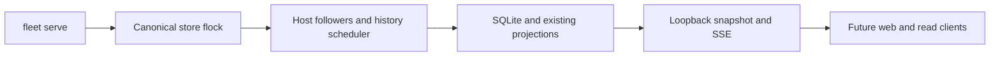

# Independent local runtime, contract v1

One `fleet serve` owns observation and scheduling for a canonical SQLite store. Web
subscription is the next step; this step also fences legacy embedded web ownership.
The store-adjacent `.runtime.lock` is an OS-held exclusive flock acquired before
workers start. Duplicate owners fail with `runtime already owned for store PATH`.
The lock is never deleted: process exit releases ownership, including after crashes.

The loopback HTTP listener binds only 127.0.0.1 (default ephemeral port). Its
store-adjacent `.runtime.json` discovery file is atomically replaced, mode 0600,
and contains `port` and `generation`. It is removed on normal stop. A stale file
is not proof of a live owner: clients must successfully contact the endpoint and
match its generation. This is a trusted local-user read API, not authentication
against other users on the same machine. No command or authority API is exposed.

- `GET /health`: `generation`, owner `pid`, `uptime_seconds`, `healthy`, `stopping`,
  `workers` (named history-scheduler and host followers: `alive`, `error`), and
  `hosts` (stream `ok`, `error`, `down_since`). An offline host does not make its
  follower dead. Worker exceptions or unexpected return remain visible.
- `GET /snapshot`: `contract_version: 1`, runtime UUID `generation`, state
  `sequence`, `pipeline_sequence`, `observed_at` (Unix seconds), `health`, existing
  live projection `document`, and all existing `pipelines` projections.
- `GET /subscribe`: SSE `event: snapshot`, with the same complete DTO as JSON in
  `data`. Always sends an initial snapshot, then sends after change or a one-second
  freshness/health interval. State and pipelines are captured under the state's
  condition lock. SQLite history polling wakes clients after external writes.

For example, cursor `(generation A, sequence 37)` followed by `(generation B,
sequence 0)` is a new runtime: replace the whole snapshot. Counters are only
comparable within one generation; pipeline changes use their own counter. There
is no durable replay or resume promise. On EOF/connection failure clients mark
runtime unavailable, retain previous data only as stale, rediscover and reconnect
with an unconditional initial snapshot. `fleet serve status` prints JSON or exits
with `runtime unavailable ... start fleet serve`; host errors are a separate field.

SIGTERM/SIGINT set the shared cancellation event, stop HTTP, and join workers with
one five-second total deadline. If workers remain blocked, retain the lock until
process exit; daemon workers cannot delay CLI exit. No new observation owner is
admitted while surviving workers can still write. A supervising service should
allow more than seven seconds for shutdown. Worker health reports thread liveness,
not a promise that a live thread cannot be blocked in transport or storage.

No schema migration, remote commands, receipts, activation epochs, orchestrator
leadership or M4 activation is included. Fixture mode is unaffected. Web conversion,
browser reconnect evidence, systemd units and deployment documentation remain
subsequent steps; no units are installed by this change.
