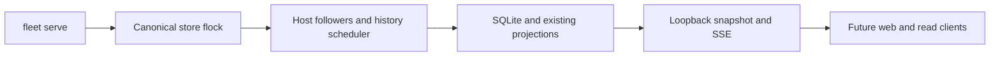

# Independent local runtime, contract v1

One `fleet serve` owns observation and scheduling for a canonical SQLite store. Web
subscribes to the runtime; library clients that request ownership use the same fence.
The store-adjacent `.runtime.lock` is an OS-held exclusive flock acquired before
workers start. Duplicate owners fail with `runtime already owned for store PATH`.
The lock is never deleted: process exit releases ownership, including after crashes.

The loopback HTTP listener binds only 127.0.0.1 (default ephemeral port). Its
store-adjacent `.runtime.json` discovery file is atomically replaced, mode 0600,
and contains `port` and `generation`. It is removed on normal stop. A stale file
is not proof of a live owner: clients must successfully contact the endpoint and
match its generation. This is a trusted local-user read API, not authentication
against other users on the same machine. No command or authority API is exposed.

- `GET /health`: `generation`, owner `pid`, `uptime_seconds`, `healthy`, `stopping`,
  `workers` (named history-scheduler and host followers: `alive`, `error`), and
  `hosts` (stream `ok`, `error`, `down_since`). An offline host does not make its
  follower dead. Worker exceptions or unexpected returns retry with exponential backoff from 250 ms
  to 30 seconds. Health keeps `last_error`, `failed_at`, `restarts`, `retrying` and
  `recovered_at`; active `error` clears after a successful history pass or host
  observation, rather than merely when a retry starts.
- `GET /snapshot`: `contract_version: 1`, runtime UUID `generation`, state
  `sequence`, `pipeline_sequence`, `observed_at` (Unix seconds), `health`, existing
  live projection `document`, and all existing `pipelines` projections. Jobs carry
  one latest document card, `documents_count` when nonzero, and
  `documents_truncated` when more cards exist. Step titles and results are previews;
  per-step git audit and full decision text are loaded on demand. `details_revision`
  invalidates the selected job's detail cache; `details_truncated` marks that read.
  Empty optional collections and false preview/attention flags may be omitted.
  Long attention `context_reference` values have an 80-character preview and
  `context_truncated: true`; `/api/decision` on web returns the complete context.
- `GET /job-detail?host=&job=`: the complete projected job, including all document
  metadata, decisions and step audit, from the current cached generation.
- `GET /job-documents?host=&job=`: complete current host document metadata.
- `GET /subscribe`: SSE `event: snapshot`, with the same complete DTO as JSON in
  `data`. Always sends an initial snapshot, then sends only when state/pipeline counters or worker/host health change.
  One-second SSE comments keep idle streams alive. A single shared daemon builder
  allows `: rebuilding snapshot` comments during slow projection; web retains its
  last snapshot and reports `connection: lagging`. Its read timeout is 15 seconds.
  Full replacements keep generation reconnect simple; there is no delta merge. State and pipelines are captured under the state's
  condition lock. SQLite history polling wakes clients after external writes.

For example, cursor `(generation A, sequence 37)` followed by `(generation B,
sequence 0)` is a new runtime: replace the whole snapshot. Counters are only
comparable within one generation; pipeline changes use their own counter. There
is no durable replay or resume promise. On EOF/connection failure clients mark
runtime unavailable, retain previous data only as stale, rediscover and reconnect
with an unconditional initial snapshot. `fleet serve status` prints JSON or exits
with `runtime unavailable ... start fleet serve`; host errors are a separate field.

SIGTERM/SIGINT set the shared cancellation event, stop HTTP, and join workers with
one five-second total deadline. If workers remain blocked, retain the lock until
process exit; daemon workers cannot delay CLI exit. No new observation owner is
admitted while surviving workers can still write. A supervising service should
allow more than seven seconds for shutdown. Worker health reports thread liveness,
not a promise that a live thread cannot be blocked in transport or storage.

No schema migration, remote commands, receipts, activation epochs, orchestrator
leadership or M4 activation is included. Fixture mode is unaffected. Web subscription and browser reconnect evidence are implemented. Systemd units
and deployment documentation remain subsequent steps; no units are installed.

Web adapter behavior (`SubscribedState`): one cancellable subscriber per web process
reads `/subscribe` and rediscoveries the store endpoint after EOF, timeout, missing
metadata or generation mismatch. The web facade starts no follower/history worker
and rejects accidental ingestion. It preserves local command/store/document APIs;
worker relabel commands wait for serve to observe the result instead of ingesting
optimistically in web. `--host` on web selects the configured hosts for local
command routing; live snapshots describe the runtime's authoritative host scope.

The web document adds `runtime`: availability, health, connection (`connected` or
`reconnected`), generation, runtime state/pipeline counters, last snapshot time,
error, start command and full worker health. Its SSE `version` is a web-local wake
counter, incremented for any new generation/state/pipeline/health cursor or loss of
connection. Clients replace full snapshots; page clients also consider generation
changes and reconcile controller-local records periodically. Web pings never turn
an unavailable runtime into a healthy one.

Before the first snapshot, the deck names runtime unavailability and has no live
projection. On loss, last work remains visible with `stale_reason: runtime
unavailable`; host stream `ok/error` retain their last observation rather than
being rewritten as a host failure. A dead runtime worker shows a named failure and
marks work stale. A host disconnect with a living reconnect loop stays a host error.
On reconnect, the first valid snapshot unconditionally replaces retained data and
shows “Runtime reconnected — live updates resumed.” Stored pages remain readable;
drafts are preserved while page live status names unavailability/worker failure.
