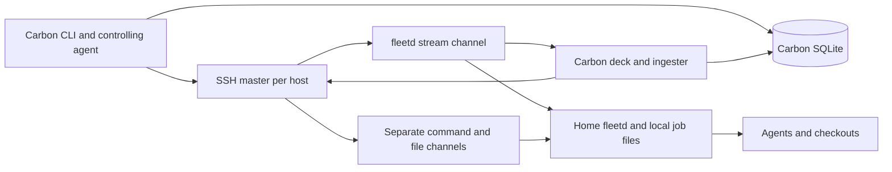
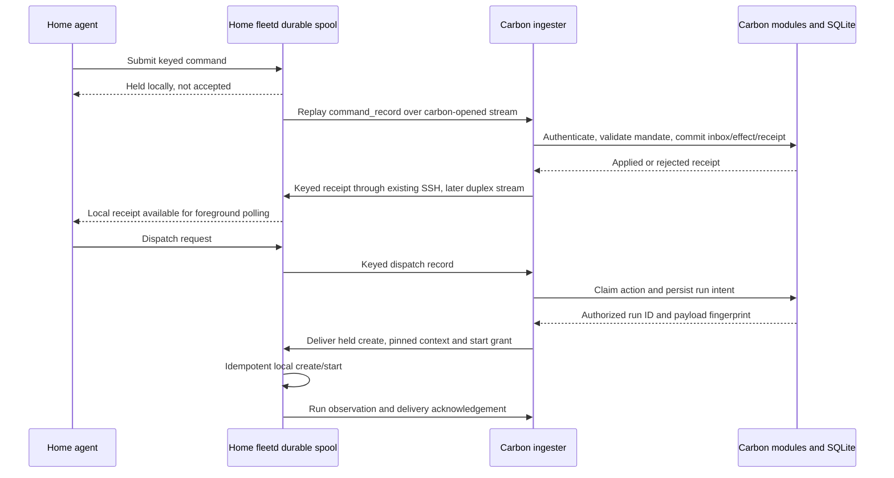

# Orchestration on a worker host

Recommend keeping carbon as the sole writer of shared state, first serving controller CLI reads and waits from ingested observations, then adding a durable, acknowledged worker command channel. Run the orchestrator beside its checkout on home only after controller-authorized dispatch and stop fencing work over that channel. Do not move the controller merely to avoid SSH calls.

This is a findings-only proposal dated 2026-10-04 for milestone `4d907b1f-bed9-41d5-9b12-49118c25ef5d`, epic `98b407bb`, and the shared sandboxed-worker requirement `2cd44e27`. No product implementation, deployment, merge or push is authorized by this study. Source line references describe this checkout; protocol examples below are proposed, not current capabilities. Cadences are configured defaults and call counts are derived from code, not measured production traffic. The brief supplies the topology: carbon owns SQLite, the deck and the controlling session; home cannot initiate a connection to carbon.

## Comparison and recommendation

| Option | Concrete benefit | What it leaves or adds | Recommendation |
|---|---|---|---|
| 1. Controller reads from streamed state | Ten waits on home need ten local subscriptions instead of ten SSH wait channels; `watch` stops requesting a list every three seconds | Dispatch, assets and uncopied document bodies still cross SSH; does not give home access to controller commands | Implement first as a bounded improvement |
| 2. Worker orchestrator, controller accepts records | Agent reads its checkout, waits on local fleetd, runs tests and performs authorized Git operations on home; no reverse network route needed | Durable commands, receipts, controller grants, mandate validation and stop fencing are necessary | Target architecture; build the same channel for sandboxed workers, then enable orchestrators |
| 3. Controller on home | Home orchestration can use the current local store interface; carbon becomes a remote viewer | Moves operational ownership, requires store/document/config cutover and remote deck access; other workers still need transport | Defer unless a separate availability/hosting requirement justifies it |

Choose 1 then 2, rather than treating 1 as a substitute for moving execution near the work. Example: controller-side `fleet wait home:RUN` can avoid SSH under option 1, while an orchestrator on home still cannot call `fleet control ACTIVATION progress` against carbon. Option 2 closes that second gap.

The proposal preserves ADR 0007's controller-only claims and partition behavior (`docs/adr/0007-execution-control.md:22–29`) and ADR 0008's single fact owner and public module commands (`docs/adr/0008-business-ownership-boundaries.md:13–28`). Extending worker transport must not quietly make worker copies accepted project state.

## 1. What crosses SSH today



`fleet/transport.py:16–22` configures `ControlMaster=auto`, a shared `fleet-%C` socket and ten-minute persistence. `Host.fleetd_command` (`:40–54`) runs a local subprocess for a local host and `ssh ... python3 ... fleetd.py COMMAND` for a remote one. Every `call` (`:145–163`) checks/establishes the master, starts another process/channel, and parses its last nonempty stdout line as JSON. Calls default to a 30-second timeout. The master check itself is local SSH control IPC, not an additional remote fleetd command.

| Call / source | Frequency and channels | Host data/effect | Controller/store requirement |
|---|---|---|---|
| `stream --events 15`, server `:338–356` | One long-lived stream per configured host per deck process; reconnect after three seconds | Job/session/input/removal/pipeline observations and heartbeat | Resolve labels to projects, reconcile runs, ingest decisions and index evidence |
| `ls --all --events 0`, `sessions --since`, server `:404–436` | Once each on every hello, including reconnections | Catch up retained jobs beyond stream horizon; sessions since last observation, bounded to 30 days | Retain previously observed runs and session reachability |
| `ls`, CLI `:224–264` | One per selected host per `ls`; repeated by `watch` every three seconds by default | Job summaries, default last 24 hours; `--all` expands | Project filters use registered host-label links |
| `sessions`, CLI `:229` | Additional per-host call when listing sessions | Live interactive sessions | Registered project links for filtering |
| Resolution `ls --all`, CLI `:88–99` | Conditional extra call to a named host or all hosts when local resolution misses | Resolve job prefixes; ambiguity is refused | Known stored runs can resolve first |
| `send` / dispatch, CLI `:302–370`, worker adapter `fleet/modules/execution/application/worker.py:30–84` | Normally `create --hold`, optional context rsync, then `start`; `reconcile` on retry/uncertain reply and possibly repeated create/start | Create/start by run ID and unchanged payload fingerprint | Validate project/work, pin guidance, persist action, claim and intended run before remote effects |
| `show`, CLI `:630–647` | One per invocation, plus conditional resolution | Full job steps and requested tail events (default 30) | Resolution; rendering mostly worker data |
| `wait`, CLI `:691–717` | One long-lived subprocess/channel per reference; CLI polls process exit every 0.5 seconds | Worker checks job/step once per second, returns terminal summary | Resolution; today completion condition is evaluated on worker |
| `result`, CLI `:744–755` | One per invocation, plus conditional resolution | Full `result-N.md` bodies, outbox paths and job directory | Resolution; distinct from short step result in stream |
| `orchestrate`, CLI `:455–484` | Activation followed by local create/context/start; remote target refused | Launches local orchestrator run | Writes activation and dispatch through local store; `control` writes through controller facades |
| Document keeper `read`, server `:172–174`, job store `:335–375` | Per document needing a copy after job updates; failed copies retry on later reports | Text body; metadata alone is streamed | Controller-owned retained copy, availability and library metadata |
| `read-trace`, transport `:188–209` | On terminal/blocked reports when source differs or prior copy failed | Complete normalized events | Content-addressed trace retention; raw runtime files remain on host |
| Reader `read` / `read-asset`, server `:323–329` | On uncached worker document/asset requests | Body or image bytes | Source identity, approved document roots; retained-reader paths may avoid SSH |
| `push` / `pull`, CLI `:282–286`, `:625–627` | On requested transfer; context push is part of dispatch | rsync contexts or outbox | Guidance versions and run association |
| Other controls: add/start/cancel/remove/move/deliver/grant | On explicit control or delivery reconciliation | Change local execution/files/permissions | Persist command intent or attention resolution as appropriate; removal preserves retained history |

The study's main commands are mapped above; ancillary transfer/control paths remain real SSH users even after option 1. Repository discovery also uses a shell channel (`fleet/transport.py:233–251`); attach does `show` then interactive SSH (`fleet/cli.py:684–688`), and tail follows worker events (`fleet/cli.py:671–680`). They are not subscriptions to the deck today.

Stream defaults in `fleet/remote/fleetd.py:2874–2880` are a 0.3-second scan and five-second heartbeat; sessions scan every two seconds (`:1272`), pipelines every second (`:1693`). Changed file signatures or runner liveness cause job emission (`:2573–2597`), not a full job message every scan. Aged terminal jobs are excluded beyond the default 24-hour horizon (`:2587–2590`); hello catch-up includes still-retained jobs. Deleted jobs without retained controller evidence cannot be reconstructed by reconnecting.

### The deadlock and the remaining pressure

The fix is present in this checkout: `fleet/web/server.py:359–377` drains both stdout and stderr separately from message application.

```python
# Applying a message may call the host again over the same ssh master
lines: queue.Queue[bytes | None] = queue.Queue()
def pump_stdout() -> None:
    for line in process.stdout:
        lines.put(line)
    lines.put(None)
```

Evidence command:

```console
$ git show --stat d245038
fix(deck): drain each host's stream on its own thread so the hello catch-up cannot deadlock the ssh master
 fleet/web/server.py                | 41 ++++++++++++++++++++----------
 tests/test_web_run_observations.py | 15 ++++++++---
 tests/test_web_stream_pump.py      | 52 ++++++++++++++++++++++++++++++++++++++
```

Example: hello applies `catch_up_jobs`; its command channel waits while stdout continues draining. This breaks the previous pipe/master cycle. It does not isolate channels from master failure, or bound the in-memory queue when ingestion is slow. A new command channel must keep transport pumping independent of store ingestion and reverse-command execution, and use durable spill/backpressure with a visible backlog rather than a queue that grows without limit.

## 2. Controller CLI reads and waits from streamed state

Already streamed (`fleet/remote/fleetd.py:1078–1104`): job/run IDs, fingerprint, label, runtime/model, description, cwd, permission, workspace with freshness/reason, timestamps, job and step statuses, short step result, step Git evidence, todos, recent events, activity, usage, decisions, document descriptors and trace descriptors. Sessions, input observations and removal provenance arrive as separate messages. Hello/heartbeat provide a snapshot boundary; they are not durable replay cursors.

```python
# fleet/remote/fleetd.py:1017–1021
live_step["result"] = outcome["summary"]
(JOBS_DIRECTORY / job_id / f"result-{step['index']}.md").write_text(outcome.get("text") or outcome["summary"])
```

Thus `result` is not already solved. `command_result` (`:2725–2736`) reads full files. `job_documents` (`:1150–1154`) lists step reports only above `REPORT_MINIMUM_BYTES`; `show` (`:2637–2641`) returns entire worker steps, while streamed steps contain selected keys. Controller ingestion retains step timing and Git data (`fleet/web/ingester.py:62–67`), not a durable complete CLI-equivalent job snapshot or event tail. Restart seeding only rebuilds a subset (`fleet/web/server.py:150–168`). Example: a tiny successful result might have a summary but no listed report document; pretending its summary is its full result would lose content.

Proposed implementation:

1. Persist a sourced job read projection with host, job/run ID, observation revision/time, complete-snapshot generation, freshness, removal provenance and explicit missing-field reasons. Persist the bounded event tail with retained count/truncation metadata. Do not read the mutable `FleetState.by_host` dictionary directly from another process.
2. Serve `ls`, supported `show` fields and wait conditions through a local controller read/subscription endpoint (Unix socket or loopback API); reuse projections in CLI and deck. When the ingester is absent, return retained data labelled stale and tell the caller that live updates are unavailable. Offer an explicit direct-worker mode; do not silently fall back to SSH.
3. Retain every step result body, including short/empty results, with hash, size, availability and completeness. Initially fetch changed bodies with the keeper; later transfer bounded/chunked bodies on the shared channel. Binary assets remain separate approved reads. Outbox needs an authoritative manifest, including non-Markdown files, rather than inferring it from copied documents.
4. Preserve CLI options, prefix ambiguity, host/project filters, step numbering, exit behavior and `--any`. Unsupported event counts or unretained full step fields say what is missing. The current wait's unstarted-queued special case (`fleet/remote/fleetd.py:2698–2702`) requires streaming an explicit wait-readiness/runner-state fact; `start_requested` alone cannot reproduce it.

Wait reads a snapshot at revision R and subscribes from R atomically, preventing a finish between read and subscription from being missed. On disconnect it reconnects with the controller cursor, reads replay then current state, and deduplicates by revision. If replay is unavailable, perform a new complete snapshot and continue with a named gap; require confirmed current state before deciding an unresolved wait. Keep the original deadline across reconnects. Unknown/offline is not success or failure; timeout is a wait outcome, never a released action claim. A retained confirmed terminal outcome remains usable after its host goes offline.

Example: a running job finishes at R+1 while the CLI connection drops. Reconnect either replays R+1 or snapshots its terminal state; it never reruns the job. Per-step waits need worker-equivalent pending/running semantics, and tests must pin the current zero/one-based behavior rather than changing it accidentally.

This option removes per-invocation SSH reads **on carbon**, not from a home CLI that has no route to carbon. Home should read its own fleetd for execution state; controller work/authority state must be supplied through option 2. Live ingestion currently depends on `fleet web` (`docs/adr/0008-business-ownership-boundaries.md:34`); extracting an always-on lightweight ingester is a later operational step, not an assumption that such a daemon exists.

## 3. Worker orchestrator and the shared record channel

Run the agent on home with local checkout access and local fleetd reads/waits. Carbon resolves its activation and pinned mandate, validates shared-state commands and authorizes dispatch. The orchestrator can run tests locally and merge locally only where the user's mandate and deployment routine permit it; a record acknowledging a merge is not permission to merge. No push permission follows from this design. The agent performs authorized product-repository Git operations; fleetd remains an execution/reporting adapter, and canonical Fleet management-record commits remain the serialized controller authoring workflow (ADR 0008, `:21`, `:36`).

Current launch explicitly refuses a remote target (`fleet/cli.py:457–458`):

```python
if not host.is_local:
    raise FleetError('orchestrator must run on the controller machine')
```

`fleet/orchestration.py:58–94` supplies an existing command vocabulary: state, progress, meet, attention, propose, dispatch, summary and decide. It is a useful receiver surface, not an authorization to forward arbitrary SQL or CLI strings. There is no accept command in this dispatcher today; do not claim remote acceptance exists simply because the mandate model names it.

### Durable commands, not accepted facts

Use a shared local fleetd submission API for sandboxed workers (`2cd44e27`) and orchestrators. The worker writes an append-only durable spool outside removable job directories. Carbon opens the connection; worker stdout emits versioned NDJSON command records alongside observations. Upgrade the negotiated stream protocol with capability flags, maximum record size and a snapshot/replay handshake. An older controller must visibly refuse remote-command activation rather than silently ignore records.

```json
{
  "type": "command_record", "schema_version": 1,
  "source": {"host": "home", "spool_id": "persistent-installation-uuid", "seq": 42},
  "record_id": "uuid", "idempotency_key": "activation-uuid:progress:7",
  "activation_id": "activation-uuid", "authority_epoch": 3,
  "mandate_version": "pinned-revision", "source_run": "run-uuid",
  "project_id": "project-uuid", "work_item_id": "work-uuid",
  "operation": "progress", "expected_revision": 12,
  "depends_on": [], "payload": {"next_step": "Review test evidence"},
  "payload_sha256": "canonical-envelope-content-sha256", "created_at": "2026-10-04T16:00:00Z"
}
```

The hash covers defined canonical immutable command content, excluding receipt/transport fields and the hash itself. A duplicate key with different content is refused; no last-writer-wins overwrite. Example: retrying `activation:progress:7` yields the same receipt, while changing its next step under that key is a conflict. Generate and persist the key before submission; today's decision CLI creates a fresh UUID each invocation (`fleet/cli.py:1642`), so manual retries currently need a new stable-key interface.

Source sequence is monotonic per persistent spool, allocated atomically with append and fsync under a lock. Multiple agent processes share that allocator. Sequence provides delivery order, not wall-clock causality or global ordering. Store an inbox unique on source identity/sequence and record ID, plus a command-receipt uniqueness constraint on authenticated activation/idempotency key. Commit receipt and accepted module effects in one SQLite transaction. Use per-object expected revisions and explicit dependencies for semantic ordering. A lower sequence replay gets its old receipt; gaps request replay and block dependent commands. Independent activations may proceed through separate ingestion queues without allowing a missing record to be silently skipped.

Initial operation allowlist: decision, progress, summary, attention/proposal, evidence registration, state request and dispatch request. Add an explicit run-link command through Execution's public linking API, with project/work validation and expected revision. Example: a locally observed test run can be linked to this milestone after carbon validates its project; the link does not retroactively invent a claim or accept a criterion. Evidence must reference retained or explicitly unavailable content with hashes/results; a worker-supplied “passed” string alone cannot meet a checked criterion. Receipt fields include record/key, source sequence, applied/rejected status, controller revision, affected IDs and structured rejection reason.

Unknown versions, invalid scope and stale revisions get durable rejected receipts with precise causes; malformed records are quarantined with visible source/sequence evidence. Explicit rejection consumes delivery sequence so one bad command does not poison the stream, but dependent commands remain rejected or waiting until their dependency is resolved. No command is shown as accepted merely because fleetd durably held it.

### Receipts and dispatch return path

Today the stream has `stdin=DEVNULL` (`fleet/web/server.py:357`). A return path is required. First slice: carbon sends keyed `fleetd receipt` batches through its existing command transport; home never connects to carbon. Later, negotiated duplex stream stdin can carry receipts, context updates, stop instructions and dispatch grants over the carbon-opened channel. Reader pumps must keep draining stdout/stderr while those messages are validated and applied on separate queues.



Keep controller `deliver_dispatch` initially: requests come back on the stream, carbon creates the claim then uses existing idempotent create/context/start transport. That is locally executed dispatch on home, not locally authorized dispatch. A later grant can let fleetd perform those same local steps without separate SSH calls; grant must bind target host, run ID, immutable payload fingerprint, activation/epoch and context digest. Never let the orchestrator start a shared action before carbon's claim transaction succeeds.

Lost receipt example: carbon applies progress then dies before sending its receipt. Replay finds the committed receipt and returns it without a second work update. Lost dispatch reply: reconcile the same run ID/fingerprint using the existing adapter (`fleet/modules/execution/application/worker.py:52–84`), not another idempotency key. Durable records do not give exactly-once process execution or undo a partially completed Git merge.

### Authority, attribution and partition behavior

Carbon creates the activation, binds actor/run/host/scope and pinned mandate, then supplies a least-privilege credential and read context to fleetd. Derive attribution from that binding, not the JSON `actor` supplied by a worker. Display **agent on behalf of user**, with principal user, agent/run, activation and mandate version separately auditable. Controller authorization already checks actor and exact scope (`fleet/modules/authority/domain/__init__.py:32–48`) and pinned mandate (`fleet/modules/authority/application/__init__.py:45–57`). Preserve those checks at ingestion, adding revoked/stopped activation and epoch validation.

The SSH host identity alone is insufficient sandbox isolation: local submission must bind credentials to the invoking run, limit filesystem/socket access, and forbid an arbitrary worker from submitting another activation's acceptance or dispatch. Example: a run serving work A cannot update work B by changing `work_item_id`; reject and retain the reason. Scope expansion requires a controller-created activation or explicit mandate evolution, not a copied charter. Triage authority stays separate: no completion or criterion judgement, and no delegation of existing attention without a confirmed project triage mandate.

Provision an immutable starting read context with revisions: work/criteria, mandate, guidance, allowed commands, linked runs and evidence. Add keyed state requests and revisioned updates over the same return path. A cached context is a copy with freshness, not an accepted-state fork. Example: a user edits a criterion on carbon while home is offline; an old `meet` command must fail its expected revision rather than accept the previous criterion.

While the stream or ingester is down, existing authorized runs can finish, local tests can run and observations/decision proposals can spool. New shared claims, acceptance and authority-dependent repository operations wait for controller acknowledgement. Report “held on home; controller unavailable”, pending count and oldest pending time. Spool storage exhaustion rejects new submissions visibly; never delete unacknowledged records to free space. Keep the spool through job removal. Only compact acknowledged records after a declared retention policy and verified controller checkpoint; restore/reinstall creates a new spool identity and explicitly reconciles remaining old records.

Routine decisions stay visible without attention. Unresolvable rejection or exceeded mandate creates user-owned attention with run/evidence links and a reason the user must act; avoid one item per replay. An optional worker escalation record cannot guarantee a deck notification during a partition: show it locally, persist it, and expose it on reconnect.

### User visibility, stop and competing orchestrators

Show a persistent orchestrator role on its work scope, current activation/run/host, mandate revision, local activity, controller receipt status, pending/rejected commands and accepted outcomes. “Tests passed locally; acceptance pending” is distinct from complete. Each work update and decision links to the originating run and evidence; an imported worker run is an observation, never an implicit claimed dispatch.

Provide two explicit controls: **Stop orchestrator** revokes this activation's authority, prevents new commands/dispatch and asks fleetd to terminate its process; **Stop orchestrator and its runs** additionally cancels the listed descendants. Say which runs are affected before execution. Record requested, controller-revoked and worker-confirmed separately. Existing `fleetd cancel` sets the job cancellation flag and signals its agent PID (`fleet/remote/fleetd.py:2711–2722`); that alone does not revoke queued controller writes or cancel all descendants.

Add one controller-owned orchestration reservation/epoch per overlapping scope; reject a second activation until the first is stopped and its execution state reconciled. Do not rely on existing action claims to prevent two orchestration loops: distinct actions can both be claimed. Overlapping parent/child scopes need an explicit exclusion rule; first release refuse overlap. Controller validates epoch at command ingestion and worker validates it at start. A replacement never takes over solely on timeout.

During a partition carbon can immediately revoke store-write authority but cannot guarantee the remote process has stopped. Mark stop unconfirmed and keep the reservation; let the user stop locally on home if immediate termination is needed. Reject replayed mutating commands from the revoked epoch while still ingesting observations. A grant already durably authorized before an outage may execute its existing run; it is not permission to mint additional claims. Offline merges should wait: a controller acknowledgement must not be interpreted as an indefinitely valid authority to make new repository changes after revocation.

## 4. Moving the controller to home

Technically plausible: the current local `fleet orchestrate --host home` could write home's canonical SQLite store, while carbon connects to home to view the deck. No home-to-carbon route is needed for that arrangement. It removes the local orchestrator's store boundary but does not remove distributed-worker communication or the sandbox credential/record-channel need.

Do not recommend it for this milestone. Example: moving SQLite alone leaves management-repository guidance, retained traces/documents and host settings on carbon, creating incomplete project ownership. A genuine move requires quiescing all writers, backing up and verifying SQLite plus canonical management records and retained copies, migrating host configuration and service paths, then fencing the old writer before starting the new one. Carbon SSH/viewer connectivity and home uptime need operational verification; this study did not test them. Rollback must fence home first and reconcile writes made since cutover, not restore a stale carbon snapshot into a second writer.

The cost is a store/hosting migration to solve a transport and locality problem. Revisit only if home should independently be the always-on project home; option 2 preserves the user's current deck location and also solves sandboxed-worker reporting.

## Failure modes and checkable examples

| Failure | Required behavior | Verification example |
|---|---|---|
| Home offline | Keep confirmed history, mark unresolved runs unknown/stale, retain claims; no reassignment by timeout | Disconnect during test run; wait expires without changing run to failed |
| Deck/ingester absent | Worker records held locally; controller reads say stale; no new shared claims | Stop ingester, submit progress, restart; exactly one accepted update |
| Stream gap / horizon | Replay durable spool independently of 24-hour job horizon; snapshot execution state with explicit completeness | Reconnect after terminal job ages out; unacknowledged decision still replays |
| Duplicate records | Stable key/hash and transactional receipts prevent repeated effects | Drop receipt, resend same dispatch key; same action/run and no second start |
| Reordered records | Sequence/dependencies and expected revisions block causal inversions | Deliver `meet` before evidence registration; it waits or rejects with cause |
| Changed payload under same key | Conflict; preserve both received evidence and original receipt | Change next step under a reused key; original update remains |
| Two orchestrators | Controller scope reservation and epoch reject overlap; unknown old process blocks takeover | Start second loop while first disconnected; no second authority grant |
| Stop during partition | Revoke controller authority immediately; show worker stop unconfirmed | Queued progress from old epoch is rejected on reconnect; observations retained |
| Slow ingestion / full spool | Independent pumps, durable queue, explicit capacity error | Delay SQLite writes; stream remains drained, backlog grows visibly within configured limits |
| Worker removed/reinstalled | Spool outlives job files; new spool identity never reuses old sequence namespace | Remove completed job before receipt; record survives until acknowledged |
| Unauthorized sandbox sender | Authenticate binding, validate operation/scope/mandate, retain rejection | Run A submits work B acceptance; no store effect |
| Partial local merge | Inspect Git evidence and working tree before retry; no claim that record dedup undoes filesystem effects | Process dies after merge commit; reconcile recorded head before attempting again |

## Migration and first slice

Stage A: durable controller read projections and snapshot/subscription contract, opt-in CLI reader, then compatibility migration for `ls/show/wait/result`. Keep explicit worker reads for troubleshooting. Stage B: shared worker spool and receipt/inbox contract for decisions and progress, scoped sandbox credentials, and replay. Stage C: controller-created remote activation plus state delivery and existing dispatch adapter. Stage D: fenced stop, competing-activation checks and authorized local test/merge workflow. Stage E: duplex control/grants and ingestion service extraction if operations warrant it. Do not remove the controller-host guard until Stage C and D safety tests pass. Full result retention and binary transfer can progress separately from small command records.

First implementation slice: prove one worker progress command survives a lost connection and is rejected outside scope. Keep orchestrator remote launch disabled. Each step is a 15–45 minute unit with a reviewable output; split any unexpectedly larger unit instead of assuming the estimate proves it fits.

| Step | Minutes | Output | Check |
|---|---:|---|---|
| 1 | 25 | Versioned record/receipt fixtures and canonical hash specification | Same key/content stable; changed content conflict; unsupported version rejected |
| 2 | 35 | Atomic local spool append and stable-key CLI submission | Restart allocator; concurrent append sequences unique; acknowledgement is only “held” |
| 3 | 30 | Stream capability advertisement and unacknowledged replay | Reconnect resends identical record; aged/removed job does not lose it |
| 4 | 40 | Controller inbox/receipt migration using isolated temporary store | Duplicate insertion returns durable receipt; transaction rollback leaves no progress effect |
| 5 | 40 | One authenticated `progress` handler through module facades | Allowed activation changes next step once; wrong run/scope/revision leaves state unchanged |
| 6 | 30 | Keyed receipt delivery over existing SSH command adapter | Drop first receipt; replay returns prior result; receipt command is idempotent |
| 7 | 25 | Local receipt polling and pending/rejection projection | Foreground CLI distinguishes held/applied/rejected and deadline expiry |
| 8 | 35 | Partition/reorder fault tests and operator transcript | Controller restart, missing sequence, changed key payload and duplicate all preserve expected state |
| 9 | 20 | Integration report and next milestone brief | Recorded commands, IDs and expected outputs; launch guard still refuses remote orchestration |

Use temporary `FLEET_CONFIG`, `FLEET_STORE`, `FLEET_HOME` and `FLEET_MANAGEMENT` for those future tests. No experiments against the user's live store. After the first slice, make stop/epoch and reservation a separate checkable milestone, then remote orchestrator dispatch. Example end-to-end acceptance: home submits progress with key K, carbon commits it, the receipt is lost, home reconnects, K receives its original receipt, and exactly one work-history change links to the authenticated home run.

## Study evidence and decisions

Read the injected constitution and renovation brief, `CONTEXT.md`, workspace PRD and ADRs 0001–0009; no epic charter was supplied in this job's context. The brief explicitly limits this work to findings. The proposal is the escalation artifact for a large feature; it does not change authority or schema today. No live attention items were delegated or resolved.

Inspection commands and relevant results:

```console
$ git branch --show-current
design/worker-orchestrator
$ rg -n 'RECONNECT_DELAY|EVENTS_PER_JOB|PIPELINE_SCAN_INTERVAL' fleet/web/server.py fleet/remote/fleetd.py
fleet/web/server.py:87:EVENTS_PER_JOB = "15"
fleet/web/server.py:89:RECONNECT_DELAY = 3
fleet/remote/fleetd.py:1693:PIPELINE_SCAN_INTERVAL = 1.0
$ rg -n 'step\["result"\]|result-' fleet/remote/fleetd.py
1017:                live_step["result"] = outcome["summary"]
1021:                (JOBS_DIRECTORY / job_id / f"result-{step['index']}.md").write_text(outcome.get("text") or outcome["summary"])
2730:        path = JOBS_DIRECTORY / job["id"] / f"result-{index}.md"
```

Also inspected transport, CLI and web sections with `sed`, plus the execution worker adapter, ingester and Authority implementation. These are static-source findings; no network behavior, deployment or throughput was benchmarked.

Decision recorded using the requested `fleet decision record --work-item 4d907b1f-bed9-41d5-9b12-49118c25ef5d --question ... --answer ... --principle ... --actor 'agent on behalf of user'`: choose controller reads then a durable acknowledged command channel, retain carbon's sole-writer authority, and present remote orchestration as a proposal. Local output assigned decision `f16da776-a990-4393-a1be-513128573fd9` and said it was handed to this job's controller via the stream. That is evidence of local holding, not confirmed controller acceptance.

The slice-sizing decision was also locally held as `50ecf589-aeef-4457-af1d-ac6d867d19aa`: prove authenticated progress/replay first in 20–40 minute units, then dispatch and stop fencing, retaining the remote-launch guard until those checks pass. Principle: constitution authority to split/order work, visibility, and ADR 0008's single fact owner.

Review should focus on the proposed reservation/epoch and credential semantics, full-result retention, and whether acknowledgement transport should begin with command batches or duplex stdin. No user action is needed to complete this study; implementation of those new concepts requires a subsequent authorized milestone.

Validation: `git diff --check` produced no errors. The initial `uv run pytest -q -m 'not browser'` used PATH's uv 0.4.6, which rewrote the lockfile during setup; that process was terminated and its generated lockfile change restored. Retried with the installed uv 0.12.18 and frozen lockfile:

```console
$ /home/adi/.local/bin/uv run --frozen pytest -q -m 'not browser'
!!!!!!!!!!!!!!!!!!!!!!!!!!!!!! KeyboardInterrupt !!!!!!!!!!!!!!!!!!!!!!!!!!!!!!!
.../fleet/infrastructure/sqlite/store.py:67: KeyboardInterrupt
19 passed, 369 deselected in 222.17s (0:03:42)
```

The suite was deliberately interrupted after slow progress and repeated filesystem-journal waits (`ps -p 1608509 -o wchan,etime` reported `jbd2_l`); other suites were running concurrently on home. This is partial verification, not a passing full suite. No failing test was reported before interruption, no base comparison was warranted, and no browser tests were run for this documentation-only study. Source inspection and document validation support the findings; the proposed protocol is not implemented or experimentally verified.
