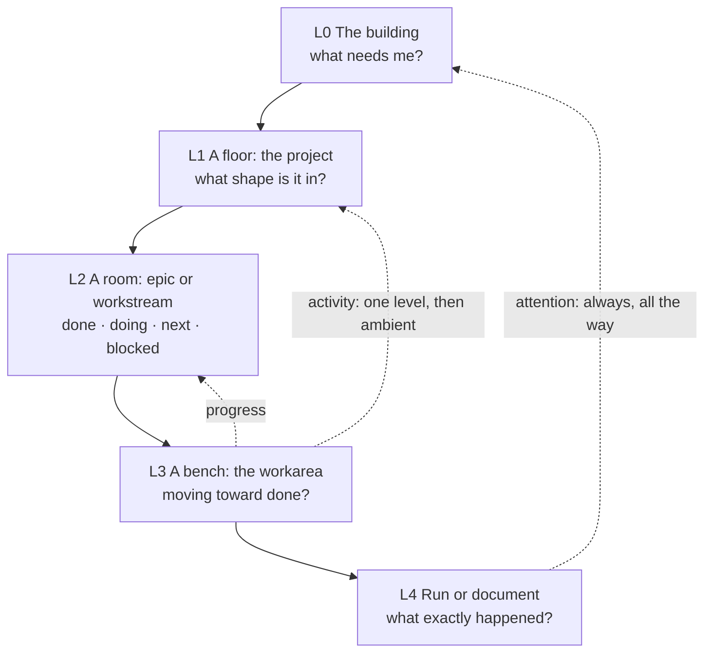

# Fleet's living workspace: product spec

> **Status:** draft for review. Describes intended behaviour, not current Fleet.
> The model underneath (identity, storage, authority, sync) is settled in the [working design](workspace-hierarchy.md), [glossary](../../CONTEXT.md) and [ADRs](../adr/). This spec refers to those decisions rather than restating them, and spends its words on the experience.

## In one minute

Fleet turns a crowd of agents into a small world you can read at a glance. It makes three commitments:

1. **Hierarchy tames overload.** Every level of the workspace answers its own few questions. Everything else is either rolled up into a signal or left for the level below.
2. **Show, don't tell.** Position, shape, light and motion carry the state of work. Text appears when you choose to read.
3. **Light, not lax.** Checking on your agents should feel like dropping into a lively little workshop, not administering a process. The playfulness is always tied to something real.

The world is a **building seen in cross-section**, like a dollhouse with the front wall taken off. Each floor is a project. You can see the whole building at once, and you click a floor to go in. The [building](../images/concept/l0.png), [project floor](../images/concept/l1.png), [workarea](../images/concept/l2.png), [lobby](../images/concept/lobby.png), [full building](../images/concept/no%20vacancies.png), and [shuttering sequence](../images/concept/shutter.png) set the visual direction. They are concept art rather than exact layouts.

The test for everything below: **if you have to read an agent's messages to find out what needs you, Fleet has failed.**

## Problem

With several agents working across projects and machines, I reconstruct their work from processes, traces, reports and scattered documents. Fleet's isometric deck already has the right spark — projects have rooms, agents occupy them, the world feels alive — but it fails in three ways:

- **Noise.** It foregrounds individual agents and their chatter at every scale. With many agents it gets busy without showing the plan, the outcomes, or what needs a decision.
- **Amnesia.** A finished agent disappears even though its work continues. Paused work vanishes, or competes with my current priority.
- **Homework.** The Library helps me find documents, but I still assemble the wider story myself.

The overload is mostly a presentation problem. When every event, document and decision arrives as another line of text, I have to remember which project it belongs to, how it relates to the plan, and whether it matters now. A conventional dashboard only moves the problem: I would still scan cards, counters and queues. Fleet should do that organising for me — visually.

## Goals and how we will know

| Goal | Achieved through | Measured by |
|---|---|---|
| **G1. Reduce overload through hierarchy** | Levels of detail, roll-up rules, text budgets, a "since you were away" view that isn't a feed | Five-second glance test; automated text budget per level; scale fixture |
| **G2. Visual and spatial before textual** | A single state-encoding table, stable places, one reserved attention signal | Redacted-text screenshot test; colour-vision and greyscale tests |
| **G3. Fun and light-hearted** | World character, delight earned by real events, calm defaults, warm microcopy | Recorded walkthrough and delight review |
| **G4. Honest continuity** (supporting) | Persistent roles and workareas, visible staleness, dossiers and archives | Behavioural checks against the model guarantees |

## Design principles

1. **One level, one set of questions.** Each level shows what its questions need and nothing more.
2. **Attention is the loudest thing on screen — and the only loud thing.** One reserved signal, used for nothing else.
3. **Motion means something.** Things move because work is happening where you are focused, or because state just changed. Never merely because an agent is busy somewhere in the background.
4. **Places are stable.** Nothing moves because it is busy, or because you changed your focus. Position is identity.
5. **Text is opt-in.** Labels at the top, short headlines one level down, paragraphs only in readers.
6. **Every cue has a backup.** No state relies on colour alone or motion alone.
7. **Delight is earned.** Every flourish maps to a real event and is scaled to its significance.
8. **A full building is a feature.** A fixed number of floors keeps commitments honest. Shuttering a project should feel tidy, not like a failure.
9. **The world never lies.** Stale looks stale, unknown looks unknown, gone looks gone.

## The information hierarchy

### The building (L0)

At the top level Fleet is a building in cross-section. The whole building fits on one screen.

**A floor's position is its identity, never its priority.** A project keeps its floor for as long as it lives in the building, and floors never move or change size because of focus or activity. You always find a project where you left it. The only things that change which project is on a floor are moving in and moving out, and I do both on purpose.

| Floor state | Meaning | What you see at L0 |
|---|---|---|
| **Open** | Priority: where I'm putting resources | The front wall slides away and you can see into the rooms: which room is busy, where a lantern hangs, progress per room. A pennant flies on the floor's edge. |
| **Windows** | Background | An ordinary facade with windows. Active work shows as a warm glow through them, alongside the floor's progress mark and any lantern. |
| **To let** | A free floor | Empty and swept, with a "To let" sign in the window. |

Several floors can be open at once. Priority is where I allocate resources, so open floors will usually be the busy ones, and that's expected. What must never happen is the reverse: a busy background floor looking important because it is busy.

This keeps the information hierarchy inside the building: the floors I care about most reveal the most, without anything moving.

### A fixed number of floors

The building has a fixed number of floors, six by default. Like the WIP limit on a kanban board, this makes overcommitment visible and gently resisted.

- **Every occupied floor counts,** open or windowed. Background work still uses a floor, because it still takes up attention.
- **Free floors are free capacity.** A "To let" floor is the kanban board's empty slot: you can see at a glance how much room is left.
- **Moving in.** Clicking a free floor offers to start a new project there or bring one back from the storehouse. A returning project goes back to its old floor if that floor is free.
- **No vacancies.** When every floor is taken and I start a new project, the lobby hangs up a "No vacancies" sign and asks which floor to clear. The prompt offers only shuttering a floor, or cancelling.
- **Adding a storey** is possible, but it's a deliberate change made in the building's settings and never offered as a shortcut from the "No vacancies" prompt. Raising the limit should feel like a decision, not an escape hatch.

### Shuttering and the storehouse

Shuttering a project archives it and frees its floor.

- The shutters roll down, the floor's contents are boxed up and carried to the **storehouse** behind the lobby, and a "To let" sign goes up.
- In the storehouse the project is a labelled crate. Its records stay in its project home, its documents stay searchable from the lobby (marked historical), and its project ID doesn't change. I can open a crate to look around the project as it was, read-only.
- Nothing new is dispatched to a shuttered project. Runs already in flight finish, and their results land in the crate. Nothing is stopped silently.
- If a shuttered project's waiting condition is met, a lamp comes on over its crate. A genuine actionable alert still reaches the front desk, with a lantern on the storehouse door.
- Shuttering is reversible: moving a crate back into a free floor restores the project exactly as it was.

The lobby on the ground floor holds everything that spans floors: the front desk with attention from every floor, the "while you were away" board, cross-project search, the key to host colours, and the door to the storehouse. A catch-up replay could be added here later.

New projects move into a free floor. Rearranging which floor a project occupies is something I do on purpose, in a separate rearrange mode, and never happens as a side effect of anything else.

### Getting around and setting focus

- **Click goes in.** Clicking an occupied floor enters it; clicking a free floor offers to move a project in. Clicks and drags on the building never change focus or position, so going in and changing focus can't be confused.
- **Focus is a switch, not a move.** Each floor has a small two-position switch on its edge (Open · Windows), and the same switch sits on the floor's briefing board inside. One click, no confirmation. The wall slides in about half a second. Because focus follows where I'm putting resources, and that changes, it has to be as cheap as flicking a light switch.
- **Shuttering is a handle, not a switch.** Pulling down a floor's shutter handle is a separate, more deliberate control. There's no confirmation, since it's reversible, but there is a clear undo while the boxes are carried out.
- **The lift panel is the way home.** Once I'm inside the building, a slim lift panel stays on the edge of the screen with one button per floor, plus L for the lobby and S for the storehouse. My current floor is lit. A floor with attention shows the lantern glyph on its button, so I can see from anywhere that another floor needs me. Pressing a button rides the lift there, and L returns to the whole building.
- **Inside a floor, a breadcrumb** (floor › room › bench) follows the real work path. Esc or the zoom-out gesture steps out one level.
- **One word, one meaning.** "Focus" means priority or background. "Shuttered" means archived to the storehouse. Going somewhere is *entering*. Neither the spec nor the UI uses "focus" for navigation.

### Levels of detail

Levels are relative to the work, not fixed types: work that skips a level simply skips it, and deeper nesting reuses the L2 presentation (a container of work) or L3 (a place where work gets done).

| Level | You are asking | You see | Held back for later | Text budget |
|---|---|---|---|---|
| **L0 The building** | What's alive, what's resting, what needs me? | Every floor in its fixed place, open, windowed or to let; a progress mark per floor; attention lanterns; activity as warm light; the lobby. Open floors also show their rooms, unlabelled. | Agents, room labels, reports, traces | Floor names only, ≤ 3 words each. No sentences. |
| **L1 A floor** (project) | What is this project doing, and what shape is it in? | A room per epic or workstream; role stations; library; briefing board by the lift doors; archive shelf; agents as small figures at their benches | Task detail, report lists, speech | One headline per room, ≤ 12 words. Briefing opens on demand. |
| **L2 A room** (epic / workstream) | What's done, happening, next, and blocked? | Benches in sequence along each lane (done → active → next); visible links to other lanes; lanterns over specific benches | Task detail, traces | Milestone names plus a one-line status. Executive summary on the board. |
| **L3 A bench** (workarea) | Is this moving toward a defined finish? | Plan wall of task tiles; completion-criteria lights; agents with action glyphs (reading, editing, testing, waiting); question desk; report tray; pinned mandate | Traces, raw logs | Short tile titles. Briefing, reports and mandate open on demand. |
| **L4 Run / document** | What exactly happened? | Trace, speech, report reader, proposed change or command | — | Unlimited. This is where reading lives. |

### Roll-up rules

How a signal from deep in the hierarchy appears further up. These rules are what keep the upper levels quiet.

| Signal | Travels up to | How it looks higher up |
|---|---|---|
| **Attention** (decision request, genuine blocker, actionable alert) | Every ancestor, to L0 | A lantern on the containing place and on its floor's lift button. One lantern per place however many items; a small count when there is more than one. Never softened by distance. |
| **Progress** | The parent | A fill or ring mark from completed versus planned milestones. Shown as unknown when there is no plan, never as zero. |
| **Activity** (runs executing) | One level up, then ambient | L1: small figures at their benches. L0: warm light in the busy room on an open floor, a warm glow through the windows of a windowed floor. |
| **Completion** | The parent, as a brief moment, then as progress | See "Earned delight". At L0 only open floors get a small one-off flourish. |
| **Stale or unknown** | Anything whose current claim depends on it | Fog or desaturation on the affected place. A floor gets a small "out of date" marker only when its focused work depends on it. |
| **Ready for review** (a waiting condition was met) | The parent, as a quiet state | A small lamp comes on at the floor's edge, or over the crate for a shuttered project. No lantern unless I opted into that condition. |
| **New reports and documents** | Not rolled up | A "new" tag on the library shelf at L1 only. Never an attention item. |

### Scale and crowding

Hierarchy has to hold up when things get busy, not just in a tidy demo.

- At L0, many agents never means many figures. Activity is lit windows.
- All floors keep the same height and the number of floors is fixed, so the building's shape stays familiar. The storehouse holds any number of crates without touching the building.
- At L1 and L3, more than five agents at one bench gather into a group figure with a count; selecting it fans them out.
- Lanterns merge per place. The scene never shows two lanterns on one place.
- On narrow screens the building's vertical stack suits portrait naturally.
- **Design target:** a 10-floor building (the largest we support), all occupied and half of them open, plus 20 crates in the storehouse, 40 concurrent runs, 3 hosts (one offline) and 6 open attention items. The whole building fits on a desktop screen without scrolling, the overview stays inside its text budget, and every lantern is findable in one look.

### Coming back: what changed while you were away

The return after a few hours is the moment overload bites hardest, so it gets a spatial answer rather than a feed.

- **"Last visit" is per person and per place.** Looking at one floor doesn't clear another, and phone and desktop agree. A place counts as visited once it has been on screen at its own level for about two seconds; scrolling past doesn't count.
- **At L0, a changed floor has a parcel by its lift doors,** plus a dot on its lift button. The parcel's size shows roughly how much changed: small, medium or large. Parcels are neutral in colour, never move, and sit well below the lantern in salience.
- **Inside a floor, changes are marked where they happened.** Newly flipped tiles glow softly, a new dossier on the archive shelf wears a ribbon, footprints lead to benches where runs happened, and new documents get a tag on the library shelf.
- **Markers clear by looking** and expire after a week in any case. "Mark all seen" lives at the lobby desk. Seeing is not resolving: lanterns are unaffected.
- **The lobby board** holds a text "while you were away" list grouped by floor, for when I want to read. It never opens by itself.

#### Later: catch-up replay

A possible later feature is a time-lapse of what happened while I was away, played in the world itself. Replay is not part of the first release; the spatial change markers and optional lobby board provide the initial return experience.

- **Two ways in.** A projector at the lobby desk replays the whole building. Unwrapping a floor's parcel replays just that floor.
- **Short.** At most 5 seconds for the building and 8 for a floor, however long I was away. A clock in the corner shows the span covered ("Tue 18:00 → now").
- **Only state changes, no text.** Agents arriving and leaving in their host colours, tiles flipping, lanterns lighting and going out, dossiers going to the shelf, walls opening, places fogging when a host went quiet. Routine trace activity is left out, just as it is everywhere else.
- **In my control.** Pause, scrub with a dial, or skip at any moment. It never plays by itself.
- **Honest.** It ends on exactly the live state. Watching it doesn't clear markers or resolve attention.
- **Accessible.** With reduced motion, it becomes a before-and-after crossfade.

## Visual language

### State encoding

Each visual channel has one job, so the same cue means the same thing at every level and in every space.

| Channel | Carries |
|---|---|
| Openness of the floor (open front, windows) | Focus (priority, background) |
| Position | Identity: which project this is. Never changes with state. |
| Agent colour | Which host the run is on, as today |
| Light and saturation | Liveliness and freshness |
| Motion | Current activity in focused work, and state transitions |
| Object and shape | Lifecycle (waiting, on hold, completed) |
| The attention marker's shape, glyph and placement | Attention — and nothing else |

| State | Primary cue | Backup cue | Must never |
|---|---|---|---|
| **Priority** | Open front: you see into the rooms | Pennant on the floor's edge | Move or grow |
| **Background** | Windowed facade | — | Open up or animate strongly because an agent is busy |
| **Shuttered** (archived) | A labelled crate in the storehouse; its floor shows "To let" | "Shuttered" on hover | Nag, animate, or raise a lantern for non-urgent readiness |
| **Free floor** | Empty and swept, "To let" sign | Dotted outline for the capacity it represents | Look like an error or a gap to be filled |
| **Active** | Warm light in the room or windows; small figures from L1 down | Gentle ambient motion (typing, a steaming mug) | Loop loudly at L0 |
| **Waiting** | A crate or hourglass showing what it waits for | Resume condition on hover | Start an agent by itself |
| **Ready for review** | A small lamp switches on | — | Become a lantern unless I opted in |
| **On hold** | Dust sheet, lights off | — | Wake because of activity elsewhere |
| **Completed** | Tile flipped; dossier on the archive shelf | Tick | Vanish |
| **Stale** | Desaturated, light fog | "Last seen" clock | Show its last value as if current |
| **Unknown** | Grey with a question glyph | — | Default to healthy |
| **Unavailable** (pruned trace, offline host) | Outline-only ghost | "Unavailable" on hover | Disappear |
| **Needs attention** | The marked lantern (see below): one swing on arrival, then a steady glow | Attention glyph and count where there is more than one | Be used for anything else, or keep moving |

The concept images set the palette direction, including magenta decorative lighting. Attention must therefore be recognisable through its marked form, placement and behaviour, not an exclusive colour. Exact objects and colours belong to detailed design; the meanings above do not.

### The attention signal

**Recommendation: a marked hanging lantern with a diamond outline.** It may use magenta, as in the concept art, but magenta lighting elsewhere in the world must not be mistaken for an attention item.

- **Where it hangs.** At L0 it hangs on the building's facade beside the floor, and the same glyph lights that floor's lift button, so attention is visible from anywhere in the building. On a floor it hangs over the room; on a bench it hangs over the question desk, or over the gauge for an alert.
- **How it behaves.** It swings once when an item arrives, then glows steadily. It never flashes or loops. Items merge per place, with a small number when there is more than one.
- **What kind.** Inside a floor, the lantern carries a glyph for the kind of item: a question mark for a decision, a raised hand for a blocker, an exclamation mark for an alert. At L0 it shows a persistent attention glyph and count, so a decorative light cannot be confused with it.
- **Why the marked form.** The concept images use magenta pendants and other coloured lights as part of the world. Colour can support attention, but the diamond form, attention glyph, placement beside the affected place, and one-time arrival motion carry its meaning in greyscale and for people with colour-vision differences.
- **Why a lantern.** It is an object in the world rather than a UI badge, it reads at small sizes, and a light left on for you suits the tone.

Alternatives considered:

| Option | In favour | Against |
|---|---|---|
| A character waving from the window | Charming, and ties attention to the role that owns it | Hard to read on a slim floor at L0; alerts from observations have no character; agents aren't shown at L0 |
| A "!" sign hung outside | Understood instantly | Looks like the speech bubbles we're removing from L0; generic and UI-like |
| A rotating beacon | Very visible | Continuous motion breaks the calm rule; one sweep then steady is really the lantern |
| A colour-only attention light | Easy to add to the scene | The concept world already uses colourful lighting; meaning would be ambiguous and inaccessible |

Runtime-defined spaces (an invoice lab, a server room) inherit this language. They define their own records and layout, but focus, freshness, completion and attention always look the same, so a new space is legible on day one.

### World lexicon (proposed)

Each concept gets one recognisable in-world form, reused at every scale, so recognition replaces reading. The building, floors, lobby and lift are decided; the smaller objects are placeholders to settle in detailed design. The one-form-per-concept rule is the requirement.

| Model concept | In-world form |
|---|---|
| All my work | The building, seen in cross-section |
| Project | A floor, furnished in the style of today's isometric rooms |
| Epic | A room on the floor |
| Workstream | A lane through the room |
| Milestone / slice | A workarea: a workshop bench with its plan wall |
| Task | A tile on the plan wall |
| Agent run | An android that arrives, works, and leaves (today's figures) |
| Role | A station with a character: the librarian's desk and book cart, the orchestrator's podium and clipboard |
| Mandate | A charter pinned beside the workarea |
| Executive summary | The briefing board by the door |
| Attention item | The lantern |
| Dossier | A bound folder on the archive shelf |
| Library | The library room |
| Focus | How open a floor is: open front or windows |
| Shuttered project | A crate in the storehouse |
| Free capacity | A "To let" floor |
| Overview hub | The lobby and its front desk |
| Navigation | The lift panel |
| Changes since my last visit | Parcels, glows, ribbons and footprints; a replay projector may follow later |
| Observation | A gauge or dial |
| Host | The colour of the agents running on it, with a key at the lobby desk: execution context, not navigation |

### Text rules

- L0: labels only, ≤ 3 words. L1–L2: headlines ≤ 12 words. Briefing boards: purpose, done, doing, next — up to three lines each by default, expandable.
- Agents at L3 show action glyphs, not sentences. Speech and traces appear only when I inspect a run.
- Numbers appear when they carry meaning ("3 of 7 criteria met"), not as decoration.

## Character and delight

The world should be enjoyable to revisit, and calm enough to read. Both are requirements.

### Earned delight

Every flourish corresponds to a real event, and its size matches the event's significance. Animations never block input, and anything longer than a second can be skipped.

| Event | What happens |
|---|---|
| Run starts | An agent steps out of the lift on its floor and walks to its bench, in its host's colour |
| Task completes | Its tile flips with a soft click |
| Run ends | The agent heads back to the lift; its outcome stays behind (a flipped tile, a report in the tray) |
| Question answered | The agent who asked perks up and gets back to work |
| Milestone accepted | Criteria lights sweep on, the dossier is bound and carried to the archive shelf, the bench resets for the next slice |
| Epic complete | A proper moment, once — then it quietly joins the archive |
| Project shuttered | The shutters roll down, the boxes are carried to the storehouse, and "To let" goes up in the window |
| Project moves in | The sign comes down, the lights come on, the furniture arrives |

### Moment size is mine to choose

Completion moments come in three sizes, set once for the whole building with an optional override per floor:

- **Quiet:** tiles flip and states change, and nothing more.
- **Standard** (the default): the table above.
- **Celebratory:** bigger milestone and epic moments, and optional sound.

The default works without anyone touching it, in line with "no configuration before ordinary work". Reduced motion behaves like Quiet whatever the setting.

### Calm by default

- Ambient life is slow and low-amplitude. Windowed floors are nearly still, free floors and the storehouse are still.
- No sound by default.
- `prefers-reduced-motion` swaps movement for fades and state changes without losing any meaning.

### Personality

Role stations have small idle behaviours that express their remit — the librarian reshelving, the orchestrator reviewing the plan wall. An idle role looks content, not broken. Empty states are friendly and useful: "Nobody's working here right now. Drop a task on the bench to get things going."

### Guilt-free

Shuttered projects are packed neatly in the storehouse, and a full building is a sign of commitment, not a problem. Idleness is never shown in red. There are no streaks, scores or badges.

### Microcopy

Short, warm, specific, plain. Humour is welcome where it costs nothing in clarity, and absent from anything that needs action.

| Instead of | Say |
|---|---|
| Milestone status: COMPLETED | Slice 4 is done. Dossier's on the shelf. |
| 3 unresolved attention items | 3 things need you |
| Project moved to status: ARCHIVED | Invoice analysis is packed away in the storehouse. Floor 3 is free. |
| Project limit reached | The building's full. Which floor should we clear? |
| Worker host-b connection lost; state may be outdated | host-b has gone quiet — its readings are greyed out until it's back |
| Awaiting resume condition: data_available | Waiting for more invoices |

## Key moments

These are the experiences the design must get right. They double as the script for the rendered walkthrough.

1. **The glance.** I open Fleet and see the building. Within five seconds I know which floors have my focus, whether a lantern is lit and on which floor, and how many floors are free. I have read no sentences.
2. **The return.** After a day away, parcels sit by the lift doors of the floors that changed, and the big one tells me where most happened. Inside, glowing tiles, ribboned dossiers and footprints show exactly what moved. I unwrap the biggest parcel and watch a few seconds of that floor's day play out, then go in. I have not opened a list.
3. **Following the supplier slice.** I click the Restoke floor. The lift panel appears at the side. I enter the V2 overhaul room, follow the supplier migration lane, and reach the active slice's bench. The plan wall shows done, doing and next; criteria lights show how close the slice is to finished; parallel agents work at the bench; the question desk is where questions wait. At each step I know where I am; pressing L takes me back to the whole building.
4. **Answering a question.** I follow the lantern to the question desk, read the question with its context, and answer in place. The proposed change or command is there to review. The lantern goes out only when the item is resolved; the agent resumes.
5. **Dispatching work.** I drop a task on a bench or station. Fleet suggests a host, which I can override. An agent walks in.
6. **Closing a slice.** The criteria have evidence. The orchestrator accepts completion within its mandate, or brings a disputed completion to me. The dossier goes to the archive shelf, pinned to the records and space definition in effect at closure.
7. **Changing focus.** I start putting more agents on suppliers. I flick Restoke's switch to Open and its front wall slides away. Invoice analysis stays windowed. Nothing moves, so everything is still where I expect it.
8. **Quiet work waking up.** Invoice analysis's waiting condition is met. A small lamp comes on at the edge of its floor. No lantern, and no agent starts.
9. **A host goes quiet.** Its colour greys out in the lobby's host key, its agents show "last seen", and the places its work feeds fog over. Nothing looks falsely healthy. When it returns, independent edits merge and conflicting claims appear as proposals.
10. **The building is full.** I try to start a new project. "No vacancies" goes up in the lobby, and I'm asked which floor to clear. I pull the shutter on a project I haven't touched in weeks. Its boxes go to the storehouse, the new project moves in, and I've made a real choice about what I'm committed to.

## User stories

I am someone directing agents across projects and machines.

**Glance and orient**

1. I want all my projects across hosts in one building, a floor each, always in the same place, so that I find every project where I left it.
2. I want to tell active, waiting, ready, on-hold, stale and completed work, and free floors, apart without reading, so that quiet work stays visible without competing.
3. I want to spot everything that needs me from the overview in one look, so that I never scan messages to find a blocker.
4. I want stable, recognisable places for projects, workstreams and roles, so that I build visual memory instead of re-reading lists.
5. I want to see which floors changed since my last visit and roughly how much, then see the changes where they happened, so that I can catch up visually without reading a feed. A short replay may make this richer later.
6. I want rough progress for each project and epic visible before I open anything.

**Levels of detail**

7. I want to move from Fleet to project, epic, workstream, workarea and run, with each level answering its own questions, so that detail arrives only when I ask for it.
8. I want a lift panel and breadcrumb that always show where I am, which other floors need me, and how to get back to the whole building, so that depth never costs me the big picture.
9. I want work to skip or add levels without the view breaking, so that the model fits the work.
10. I want traces, speech and report lists kept out of the upper levels, so that many agents don't mean a noisy world.
11. I want an executive briefing — purpose, done, doing, next — at any scope, so that I never reconstruct the plan from traces.
12. I want to switch a space to a list, chart, search or reader and have it remember, so that dense information gets its clearest form.

**A living world**

13. I want agents to arrive at the workarea they contribute to, work visibly and leave, with their outcome staying behind, so that motion reflects real work without implying permanent processes.
14. I want roles and workareas to stay present when idle, showing remit, queue, last outcome and next trigger, so that the world represents ongoing responsibilities.
15. I want small moments to mark completions, scaled to how much they matter and with a size I can choose, so that progress feels tangible without becoming noise.
16. I want background floors to stay calm however busy their agents are, so that busy never masquerades as important.
17. I want the new views to keep the current deck's character while free to change viewpoint where that is clearer, so that Fleet still feels like the same place.
18. I want reduced-motion and colour-vision needs respected without losing meaning.

**Acting from the scene**

19. I want to answer a question, accept a proposed change, resume work or dispatch an agent from the object it concerns, with the underlying change or command available to review, so that I act without administrative screens or Git mechanics.
20. I want to open or window a floor with one click as I shift resources, with several floors open at once, and have that choice survive activity, so that the building follows my focus without anything moving.
21. I want a fixed number of floors, with shuttering as the way to free one, so that taking on a new project means deciding what to set aside.
22. I want Fleet to suggest a host when I dispatch and let me override it, so that dispatch stays simple.
23. I want an attention item to stay until I acknowledge, snooze or resolve it, so that looking at it never dismisses it by accident.

**The Restoke walkthrough and validation cases**

24. I want the V2 overhaul epic to show supplier migration and development experience as separate workstreams with visible links where findings cross between them.
25. I want the active supplier slice to give its plan, completion criteria, agents, question desk, briefing and reports distinct places, with parallel runs attached to the same milestone, so that I can tell whether it is heading to a defined finish.
26. I want each supplier slice treated as one milestone, so that I track bounded outcomes rather than every Ralph-loop step.
27. I want a completed slice to leave a dossier and an archived view pinned to its closure revision, so that later edits don't rewrite what happened.
28. I want paused invoice analysis to rest in the background with its resume condition visible, and its runtime-defined lab to show corpora (tagged, raw, awaiting processing), experiments, error findings and strategies, without Fleet knowing invoice semantics.
29. I want a server monitoring project to show resources, processes, containers and security findings, with stale readings never looking healthy.

**Keeping it light**

30. I want routine work to need no branch, approval or configuration administration.
31. I want opening Fleet to feel like visiting a small workshop I enjoy, so that checking in is something I'd do for its own sake.

## Model guarantees

The experience depends on these. Each is decided in the linked record; the second column says why the experience needs it.

| Guarantee | What it gives the experience | Decided in |
|---|---|---|
| Projects have stable IDs. A known ID auto-joins a new worker; matching names or repos only suggest a link; renames never split. | One project is one place, whichever hosts it runs on | [ADR 0001](../adr/0001-stable-project-identity.md) |
| Hosts are execution context. Inspecting a run shows where it ran and what the host provided. | The world stays project-first | [Working design](workspace-hierarchy.md) |
| One logical project home; a management repo holds durable plans, summaries, decisions, dossiers and retained space definitions; product docs stay in their canonical homes; live state stays out of Git. | Places and history survive workers coming and going | [ADR 0002](../adr/0002-authoritative-project-home.md) |
| Disconnected workers keep recording; shared state shows as stale; independent edits merge; conflicts become proposals; writes are serialised with author and source-run provenance. | The world never lies, and reconnection never overwrites | [ADR 0002](../adr/0002-authoritative-project-home.md) |
| Raw traces stay on workers under retention; unavailable links stay visible as unavailable. | L4 detail exists without cluttering the record | [Working design](workspace-hierarchy.md) |
| Versioned mandates let orchestrators refine plans, publish progress and accept evidenced milestones; goal, priority and major-decision changes come to me. | Fewer, better interruptions | [ADR 0003](../adr/0003-agent-authorship-of-project-records.md) |
| The librarian makes reversible documentation improvements directly in Git and brings disputed facts and accepted decisions to me. | The library tidies itself | [ADR 0003](../adr/0003-agent-authorship-of-project-records.md) |
| The library lists canonical documents before supporting artifacts; I control inclusion and order; cross-project search shows project, source and current or historical status. | Reading at L4 stays orderly | [Working design](workspace-hierarchy.md) |
| Spaces are views over shared records. Agents can draft spaces; useful ones are retained; vocabulary changes that reinterpret records need review and a migration plan. | New kinds of places without changing the core | [ADR 0004](../adr/0004-runtime-spaces.md) |
| Shuttering archives a project without changing its ID or deleting records; in-flight runs finish; unshuttering restores it exactly. | The storehouse is safe to use, so the floor limit costs nothing but a choice | [ADR 0005](../adr/0005-fixed-project-capacity.md) |
| Waiting and on-hold never start agents. | Calm | [Working design](workspace-hierarchy.md) |
| Attention items have an owner, a source, and open, acknowledged or snoozed, and resolved states. | The one loud signal stays trustworthy | [Working design](workspace-hierarchy.md) |
| Observations carry source, timestamp and freshness period. | Stale looks stale | [Working design](workspace-hierarchy.md) |
| State changes to work items, attention and runs are timestamped and kept for at least as long as change markers last (a week), without needing raw traces. | Change markers can be rebuilt honestly; the same history could support later replay | [Working design](workspace-hierarchy.md) |
| The current live host/job/session stream, document reader and local Library remain inputs; a project record and view layer sits above them. | Incremental delivery from today's deck | — |

## Experience decisions

- **L0 is a building in cross-section, one floor per project.** Floors never move or resize. Focus is shown by how open a floor is, and several floors can be open. The lobby holds everything that spans floors, including cross-project search.
- **The building has a fixed number of floors** (six by default) as a WIP limit. Shuttering archives a project to the storehouse and frees its floor. Adding a storey is a deliberate settings change.
- **Click enters; a switch sets focus; a handle shutters.** A lift panel is always available once inside. "Focus" never means navigation.
- **Hosts are shown by agent colour**, as in today's deck, with a key at the lobby desk. There is no separate host structure in the building.
- **Catch-up replay is deferred** beyond the first release. The first return experience uses spatial change markers and the optional lobby board.
- **Completion moments are configurable** (Quiet, Standard, Celebratory), with Standard as a default that needs no setup.
- **Attention uses a marked lantern with a diamond outline and an attention glyph.** The concept art's magenta decorative lights remain; hue alone must not carry attention. Exact colour and object design are settled against the concept images in detailed design.
- **First delivery** is the supplier slice walkthrough (key moment 3) from L0 to archive, including the overview, project and epic context needed to reach it.
- **The isometric deck is the reference** for character and continuity. Projection and camera may change where that improves legibility. The workspace must not become flat status pages with decorative room art, nor a SaaS grid of cards, filters and tables.
- **Game-like as a navigation and feedback language**, not as points, badges or scores.
- **Interaction begins in the scene.** Opening a plan, briefing, report, dossier or attention item follows from the object that represents it. Panels and forms are for reading and precise input.
- **Places are semantic.** A plan wall need not be a literal wall; its location and treatment must tell me what it is for before I open it.
- **One visual language for every space**, as set out in the state-encoding table. Runtime spaces and plugins inherit it.

## Testing

The first acceptance check is the experience itself. Technical checks support it; they cannot replace it.

### Experience acceptance

- **Five-second glance test.** Show a reviewer unfamiliar with the fixture the overview for five seconds. They should name the focused project, point to where attention is, identify one waiting or on-hold item, and say how many floors are free. Repeat at the slice workarea: the next task, how close to done, and whether anything is blocked.
- **Redacted-text test.** Render the overview and the workarea with every glyph replaced by a block (a debug mode such as `?redact`). The reviewer should still identify focus, attention, staleness, waiting work, free floors and rough progress. This is the direct test of "visual before textual".
- **Colour-vision, greyscale and reduced-motion tests.** Repeat the glance test under colour-vision simulation, in greyscale, and with reduced motion. Every state stays distinguishable.
- **Text budget (automated).** Count visible words at each level in the rendered view and fail when a level exceeds its budget.
- **Calm check (automated where possible).** With activity only on windowed floors, those floors show no looping motion and no lantern, and in-flight runs finishing for a shuttered project leave the storehouse still.
- **Capacity test.** With every floor occupied, starting a project raises "No vacancies" and offers only shuttering or cancelling. Shuttering frees the floor, keeps the project ID and records, leaves in-flight runs to finish, and moving the crate back restores the project exactly.
- **Scale fixture.** The design target above (10 floors, 20 crates, 40 runs, 3 hosts with one offline, 6 attention items) fits on one desktop screen without scrolling, stays inside its text budget, and has every lantern findable in one look.
- **Wayfinding test.** Without instruction, a reviewer goes from a bench on one floor to a bench on another and back to the whole building. They also change a floor's focus with its switch, and confirm that nothing in the building moved.
- **Return test.** After a simulated absence with changes, the reviewer uses the parcels to name the floor where most changed, then points to what changed without opening a list. Visiting one floor leaves other floors' markers in place.
- **Later replay test.** If catch-up replay is built after the first release, check that building and floor replays show real changes in order, stay within their time limits, can be skipped, and end on the live state. This does not gate the first release.
- **Delight review.** Record the walkthrough. Does every animation correspond to a real event? Does closing a slice feel satisfying? Is anything noisy, twee or slow? Would you open this just to check in?

### Behavioural checks

Test through the highest practical seam: run the Fleet web app against controlled host streams and temporary project homes, then inspect HTTP responses, rendered views and durable records. Reuse the existing dashboard HTTP tests for state and documents; use browser checks, at desktop and narrow viewports, wherever hierarchy and spatial arrangement determine the result.

- The Restoke fixture — active supplier slice, separate development-experience workstream, parallel runs, an earlier completed slice, background invoice analysis — answers different questions at each level without routine traces leaking upward.
- Across two hosts: one project ID gives one project view; a rename keeps identity; name collisions don't merge; an offline host is visibly stale.
- Focus survives activity; a waiting condition becomes ready without dispatching an agent; attention stays open until acknowledged, snoozed or resolved.
- An orchestrator's in-mandate progress and evidenced completion land directly; changed goals or disputed completion become proposals. Librarian edits carry provenance in Git history.
- Reconnection with independent and conflicting offline edits never depends on arrival order.
- The library and search distinguish canonical, supporting, current, historical and unavailable documents; an archived slice stays tied to its closure revision.
- Observation freshness is checked at the rendered boundary. The invoice and server cases validate the shared semantics without invoice or infrastructure fields in Fleet's core.

## Out of scope

- Invoice classification logic, taxonomy, experiment algorithms or corpus processing. The invoice lab is a validation case and may follow the supplier slice.
- A built-in server collector, Docker management, security audit engine or fixed server-room schema. These may arrive as plugins.
- Host authorisation, fine-grained permissions, multi-user administration and team collaboration in the first release.
- Enterprise workflow machinery, productivity scores, gamified rewards, and configuration that must happen before ordinary work.
- Policy for specific external actions such as metered API use. Fleet presents the decision in terms of mandate, risk and cost; the policy lives elsewhere.
- Central storage or indefinite retention of raw traces.
- Sound design beyond "off by default".
- Catch-up replay in the first release. Spatial change markers and the optional lobby board provide the initial return experience.
- Telling hosts apart once there are more than colour can distinguish. We'll solve that when we get there.
- Any mandate to keep isometric projection everywhere or to put every record in a room. Lists, charts, search and the reader remain first-class inside the world.

## Decisions log

| Question | Decision |
|---|---|
| The L0 metaphor | A building in cross-section, one floor per project; clicking a floor enters it |
| Where floors sit | Fixed. Position is identity; floors never move or resize with focus or activity. Rearranging is a deliberate separate mode. |
| Showing focus | By openness: open front (priority), windows (background), set with a one-click switch. Several floors can be open; priority is where I put resources. |
| Number of floors | Fixed, six by default and ten at most, as a WIP limit. "No vacancies" asks which floor to clear. Adding a storey is a deliberate settings change. |
| Parking a project | Shuttering archives it to the storehouse and frees the floor. Reversible. |
| Hosts | Agents are coloured by host, as today, with a key at the lobby desk. Scaling beyond the palette is deferred. |
| The attention signal | A marked lantern with diamond form, glyph, location and count; one swing then steady. The concept images' magenta decorative lights remain, so colour alone does not mean attention. |
| Agents at L1 | Small figures at their benches |
| The return view | Per-person, per-place "last visit"; parcels at L0, in-place markers inside |
| Catch-up replay | Deferred beyond the first release; initial return uses spatial change markers and the optional lobby board |
| Cross-project search | At the lobby desk |
| Milestone moments | Configurable: Quiet, Standard (default), Celebratory |
| Concept images vs this spec | Where they disagree, the spec wins. L0 shows activity as light, never agent figures (unlike `no vacancies.png`). The diamond form is reserved for the attention lantern; decorative lights use other shapes (unlike the lobby pendants). A shuttered project's lantern moves to the front desk and storehouse door, never stays on the "To let" floor (unlike `shutter.png`). |
| First L1 layout | A cluster of benches stands for an epic's room; walls between rooms are optional. |
| Floor legibility | Ten floors must read on one desktop screen, achieved by framing, slimmer slabs and the lift panel. The L0 camera keeps a three-quarter view as in the concept art; a flat front elevation loses the building's depth. |
| Glossary | Project-level "parked" is now "shuttered (archived)"; "on hold" covers work set aside inside a live project; "focus" means priority or background only. Glossary, working design and ADR 0005 updated. |

## Open questions

None at present. Detailed layouts, exact palette and object design belong to the detailed-design phase, starting with the supplier slice walkthrough.
