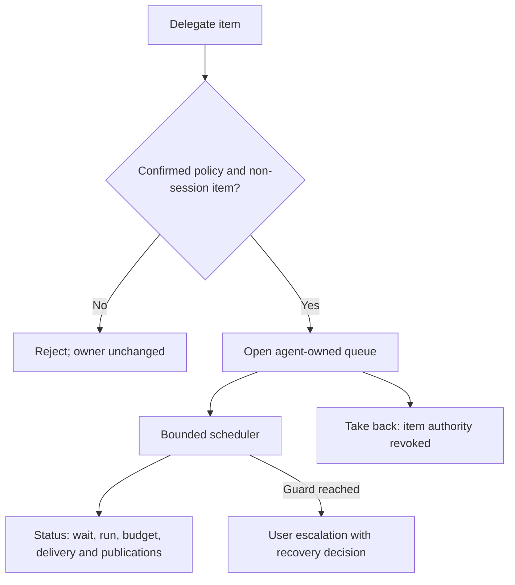

# Setting up triage

A confirmed policy enables delegation; recording it creates a new version for future activations. Active runs keep their pinned version and existing attention ownership stays unchanged. No sample is applied automatically. Triage cannot complete work or judge criteria.

Copy this sample to a local JSON file and explicitly replace `CHOOSE_CONTROLLER_HOST` and `/CHOOSE/ABSOLUTE/CHECKOUT`. Choose the runtime, its permission mode, routing rules, allowed commands and limits for your project. The sample deliberately grants only record/escalate authority and routes new problems to the user; it does not enable retries, steps or grants. `workspace-write` is a Codex permission mode; use an appropriate mode if you choose Claude.

```json
{
  "goal": "Inspect delegated attention and record findings or escalate decisions",
  "constraints": ["Do not complete work or judge criteria", "Do not dispatch duplicate runs with unknown outcomes"],
  "decision_authority": ["record_decision", "escalate"],
  "escalation_conditions": ["A remedy needs authority outside this policy"],
  "criteria_it_may_judge": [],
  "host": "CHOOSE_CONTROLLER_HOST",
  "runtime": "codex",
  "cwd": "/CHOOSE/ABSOLUTE/CHECKOUT",
  "permission": "workspace-write",
  "routing": {"failed": "user", "stalled": "user", "lost": "user", "refusal": "user", "blocked": "user"},
  "permissions": {"allow": [], "escalate": ["Bash"]},
  "limits": {"retries_per_step": 1, "runs_per_day": 3, "unclaimed_minutes": 30}
}
```

`goal`, `constraints` and `escalation_conditions` explain the task boundaries. `decision_authority` lists authorized triage commands; `criteria_it_may_judge` must remain empty. `host` must be the controller machine; `cwd` is its project checkout. `routing` controls ownership of new observations; omitted categories go to the user. `permissions.allow` names grantable rules and `permissions.escalate` names rules requiring the user. Bash grants still require user confirmation. Limits bound retries, daily activations and queue wait; this sample's values are examples requiring your choice.

Inspect current policy before recording your edited file:

```sh
fleet triage policy show PROJECT
fleet triage policy set PROJECT --file triage-policy.json --actor ACTOR
fleet triage status PROJECT
```

Policy show and status are read-only; both accept `--json`. Setting a policy prints the recorded version and changed fields. Delegate keeps attention open under With agent, and Take back revokes authority for that item while the process may continue handling other items:

```sh
fleet attention delegate ITEM --actor ACTOR --note 'Inspect the failure under the confirmed policy'
fleet attention take ITEM --actor ACTOR --reason 'I will handle this item'
```

Both handovers accept `--json` for the resulting item. Without a confirmed policy, delegation is rejected before ownership changes. Session questions remain terminal-only.

If delivery fails, inspect `fleet triage status PROJECT` and `fleet run show RUN` to determine the existing run's outcome before launching anything else. For example, `connection refused` with an unknown outcome does not prove the run never started. If the daily budget is exhausted, status and the escalation give the next midnight reset timestamp in the controller clock's timezone. Decide whether to handle the item yourself or restore service and delegate again after the reset; the scheduler never increases the policy budget. Pending publications indicate decisions whose archival delivery is still outstanding.


